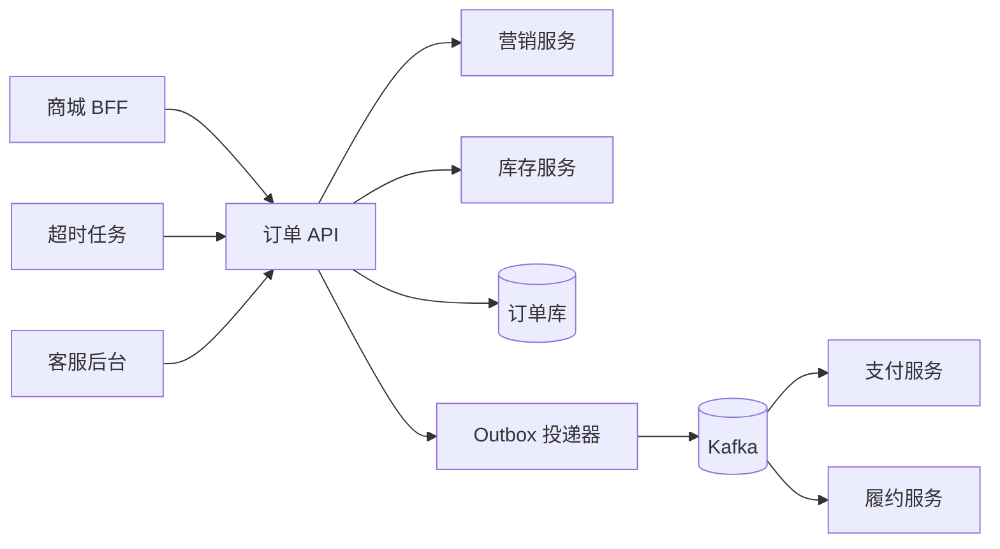
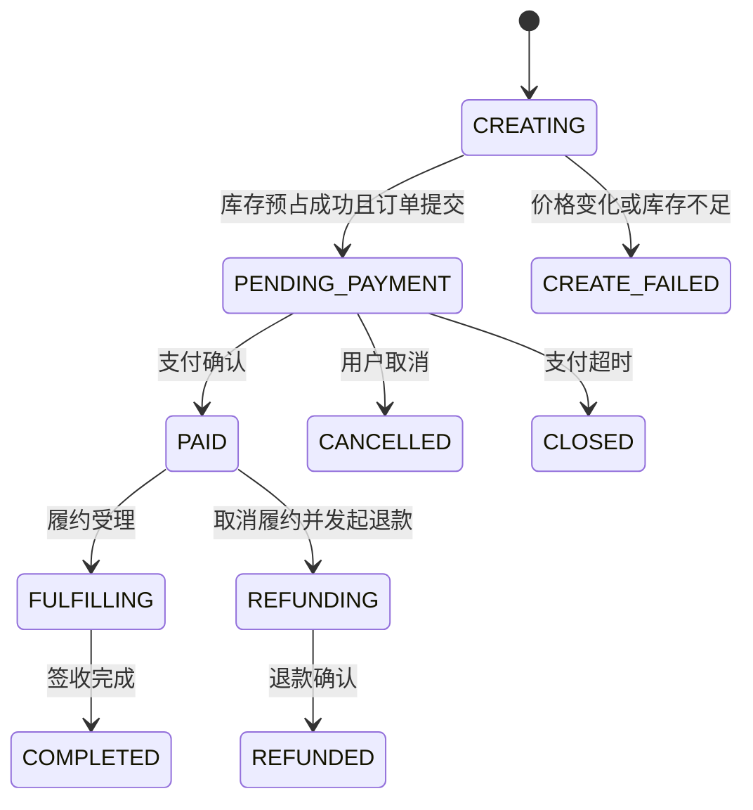
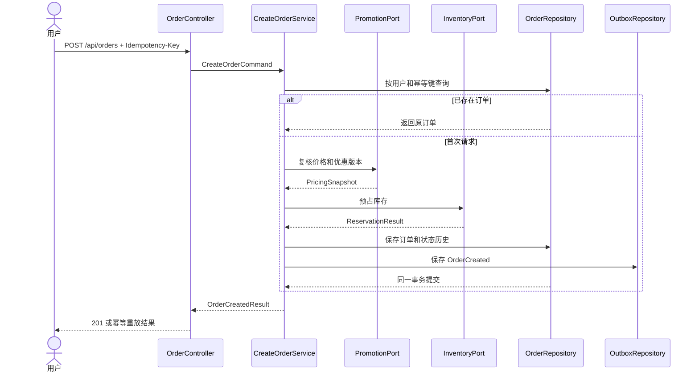

# 星河商城订单域详细设计说明书

> 示例基线  
> 本文承接《星河商城总体设计说明书》，聚焦订单域的创建订单、支付确认、取消和超时关闭。所有接口、表结构、容量和错误码均为可执行样例，但仍属于虚构系统，正式项目必须通过代码、契约测试、压测和评审结果校准。

详细设计记录那些无法只靠阅读代码稳定理解的约束，包括业务不变量、状态转换、事务边界、幂等键、失败处理和对账入口。自动生成的完整 API 文档、DDL 和类参考应由代码仓库持续发布，本文只保留关键契约和设计理由。

## 文档控制

| 项目 | 示例值 |
|---|---|
| 文档编号 | XH-MALL-ORDER-DD-001 |
| 项目 | 星河商城一期建设 |
| 设计对象 | 订单域和订单服务 |
| 版本 | V1.0-draft |
| 状态 | 示例基线，待项目评审 |
| 责任角色 | 订单域技术负责人 |
| 评审角色 | 架构、订单研发、库存研发、支付研发、测试、安全、运维 |
| 总体设计基线 | XH-MALL-HLD-001 V1.0 |
| 需求基线 | XH-MALL-SRS-001 V1.0 |

### 修订记录

| 版本 | 日期 | 影响范围 | 变更内容 | 状态 |
|---|---|---|---|---|
| V0.1 | 2026-07-22 | 订单创建、支付确认、取消 | 建立订单域详细设计样例 | 待评审 |

### 设计范围

| 包含 | 不包含 |
|---|---|
| 订单创建、价格快照、库存预占 | 商品和促销规则内部计算 |
| 待支付、已支付、取消、关闭状态 | 支付机构内部支付流程 |
| 支付结果接收、主动查单、对账关联 | 仓库拣货、打包和出库算法 |
| 订单事件、超时任务、人工补偿入口 | 售后退款完整流程 |

## 需求追踪

| 需求编号 | 设计响应 | 代码或配置证据 | 测试证据 |
|---|---|---|---|
| BR-002 | 保存商品、价格、优惠和运费快照 | OrderPricingSnapshot、order_item | 金额复核契约测试 |
| BR-003 | 库存预占成功后才提交订单 | InventoryReservationPort | 并发库存和超时释放测试 |
| BR-004 | 支付回调使用机构流水号和事件号去重 | payment_confirmation 唯一索引 | 回调重放测试 |
| QR-002 | 创建订单同步链路只保留价格复核、库存预占和订单提交 | CreateOrderService | P99 延迟压测 |
| QR-003 | 订单事实写入 MySQL，Outbox 同事务提交 | orders、order_outbox | 恢复和事件重放测试 |

## 设计上下文

### 上下游关系



### 业务不变量

1. 同一用户提交相同幂等键，只能生成一个订单号。
2. 订单应付金额等于商品金额减优惠金额加运费，所有金额使用分为单位的整数。
3. 库存预占失败时不能生成可支付订单。
4. 已支付订单不能直接关闭，必须进入退款或售后流程。
5. 任何状态变化都要记录前后状态、触发来源、关联事件和操作时间。
6. 订单事件的发布失败不能回滚已经提交的订单事实，但必须可监控、重试和人工补投。

## 模块详细设计

### 组件职责

| 组件 | 职责 | 允许依赖 | 禁止行为 |
|---|---|---|---|
| OrderController | 协议校验、身份解析、错误映射 | CreateOrderService、OrderQueryService | 直接访问 Repository |
| CreateOrderService | 编排价格复核、库存预占和订单提交 | PromotionPort、InventoryPort、OrderRepository | 持有跨服务事务 |
| OrderAggregate | 校验不变量并执行状态转换 | 值对象、领域事件 | 调用网络或数据库 |
| OrderRepository | 保存订单聚合和状态历史 | MySQL | 返回未提交的半成品对象 |
| OrderOutboxRepository | 与订单事实同事务保存事件 | MySQL | 在事务内直接发送 Kafka |
| OrderEventPublisher | 扫描、投递和确认 Outbox | Kafka、MySQL | 无上限重试 |
| PaymentConfirmationService | 处理支付成功、失败和重复回调 | PaymentQueryPort、OrderRepository | 根据回调文本判断结果 |
| OrderTimeoutJob | 关闭超时未支付订单并释放库存 | OrderRepository、InventoryPort | 扫描无索引的大范围数据 |

### 包结构

```text
com.xinghe.mall.order
├─ api                 HTTP 协议、请求和响应模型
├─ application         用例编排、事务边界
├─ domain              聚合、值对象、领域服务和事件
├─ infrastructure
│  ├─ persistence      Repository 和数据映射
│  ├─ messaging        Outbox 与 Kafka 适配
│  └─ client           营销、库存、支付适配
└─ support             错误码、时钟、标识生成和审计
```

### 订单状态机



| 当前状态 | 事件 | 目标状态 | 前置条件 | 副作用 |
|---|---|---|---|---|
| CREATING | InventoryReserved | PENDING_PAYMENT | 金额复核通过，全部库存已预占 | 写入 OrderCreated |
| PENDING_PAYMENT | PaymentConfirmed | PAID | 支付金额与订单应付金额一致 | 写入 OrderPaid |
| PENDING_PAYMENT | UserCancelled | CANCELLED | 不存在已确认支付 | 发布 InventoryReleaseRequested |
| PENDING_PAYMENT | PaymentExpired | CLOSED | 超过支付截止时间且主动查单未支付 | 发布 InventoryReleaseRequested |
| PAID | FulfillmentAccepted | FULFILLING | 履约单创建成功 | 记录履约单号 |

### 创建订单流程



### 事务边界

创建订单的本地事务包含 orders、order_item、order_status_history 和 order_outbox。价格复核与库存预占发生在事务外，避免长事务占用连接。库存预占成功但订单事务提交失败时，应用发布带 reservationId 的释放命令；释放命令和库存服务接口都必须幂等。

## 接口详细设计

### 创建订单

`POST /api/orders`

请求头

| 名称 | 必填 | 规则 |
|---|---|---|
| Authorization | 是 | 用户访问令牌 |
| Idempotency-Key | 是 | 16 至 64 字符，同一用户范围内唯一 |
| X-Request-Id | 否 | 调用方请求号，未提供时由网关生成 |

请求体

```json
{
  "checkoutToken": "ck_01J0EXAMPLE",
  "addressId": "addr_1024",
  "items": [
    {
      "skuId": "sku_90001",
      "quantity": 2,
      "promotionVersion": "promo_20260722_3"
    }
  ],
  "clientTotalAmount": 19900
}
```

成功响应

```json
{
  "orderId": "ord_20260722_000001",
  "status": "PENDING_PAYMENT",
  "payableAmount": 19900,
  "currency": "CNY",
  "paymentDeadline": "2026-07-22T12:30:00+08:00",
  "replayed": false
}
```

### 错误码

| HTTP | 错误码 | 触发条件 | 调用方处理 |
|---:|---|---|---|
| 400 | ORDER_INVALID_REQUEST | 数量、地址或令牌格式错误 | 修正请求，不重试 |
| 409 | ORDER_PRICE_CHANGED | 服务端金额与客户端金额不一致 | 刷新结算页并重新确认 |
| 409 | ORDER_OUT_OF_STOCK | 任一 SKU 无法预占 | 提示缺货并刷新购物车 |
| 409 | ORDER_IDEMPOTENCY_CONFLICT | 同一幂等键对应不同请求摘要 | 停止重试并记录客户端缺陷 |
| 429 | ORDER_RATE_LIMITED | 用户或活动配额耗尽 | 按 Retry-After 延迟重试 |
| 503 | ORDER_DEPENDENCY_UNAVAILABLE | 价格或库存依赖不可用 | 短暂重试，超过窗口后提示稍后再试 |

### 幂等规则

服务端以 user_id、idempotency_key 建立唯一约束，并保存请求体规范化后的 request_hash。重复请求且摘要一致时返回原订单；摘要不一致时返回 ORDER_IDEMPOTENCY_CONFLICT。幂等记录至少保留 24 小时，不能仅存于 Redis。

### 支付确认接口

支付服务调用 `POST /internal/orders/{orderId}/payment-confirmations`。请求包含 paymentId、providerTransactionId、paidAmount、paidAt 和 eventId。order_payment_confirmation 对 provider_transaction_id 和 event_id 分别建立唯一约束。重复事件返回 200 和原处理结果，不重复变更订单状态。

### 领域事件

| 事件 | 分区键 | 关键字段 | 消费方 |
|---|---|---|---|
| OrderCreated | orderId | userId、items、payableAmount、reservationId | 支付、通知、分析 |
| OrderPaid | orderId | paymentId、paidAmount、paidAt | 履约、通知、积分 |
| OrderCancelled | orderId | reason、operator、reservationId | 库存、通知、分析 |
| OrderClosed | orderId | reason、deadline、reservationId | 库存、通知、分析 |

事件载荷只能追加兼容字段。破坏性变更发布新 eventType 或 schemaVersion，并在迁移窗口内同时支持新旧消费者。

## 数据详细设计

### 核心表

#### orders

| 字段 | 类型 | 约束 | 说明 |
|---|---|---|---|
| id | bigint | PK | 内部主键 |
| order_no | varchar(32) | UNIQUE | 对外订单号 |
| user_id | bigint | INDEX | 下单用户 |
| idempotency_key | varchar(64) | 与 user_id 联合唯一 | 创建订单幂等键 |
| request_hash | char(64) | NOT NULL | 规范化请求摘要 |
| status | varchar(32) | INDEX | 订单状态 |
| goods_amount | bigint | NOT NULL | 商品金额，单位分 |
| discount_amount | bigint | NOT NULL | 优惠金额，单位分 |
| freight_amount | bigint | NOT NULL | 运费，单位分 |
| payable_amount | bigint | NOT NULL | 应付金额，单位分 |
| payment_deadline | datetime(3) | INDEX | 支付截止时间 |
| version | int | NOT NULL | 乐观锁版本 |
| created_at | datetime(3) | NOT NULL | 创建时间 |
| updated_at | datetime(3) | NOT NULL | 更新时间 |

关键索引

```sql
UNIQUE KEY uk_order_no (order_no),
UNIQUE KEY uk_user_idempotency (user_id, idempotency_key),
KEY idx_user_created (user_id, created_at DESC),
KEY idx_status_deadline (status, payment_deadline)
```

#### order_item

| 字段 | 说明 |
|---|---|
| order_id、line_no | 订单项联合唯一标识 |
| sku_id、sku_name | SKU 标识和下单时名称快照 |
| quantity | 购买数量 |
| unit_price、discount_amount、payable_amount | 行级金额快照 |
| promotion_version | 价格复核使用的规则版本 |
| product_snapshot | 展示属性的 JSON 快照，不参与金额计算 |

#### order_outbox

| 字段 | 约束和用途 |
|---|---|
| event_id | 唯一事件号 |
| aggregate_id | 订单号，作为 Kafka 分区键 |
| event_type、schema_version | 契约标识 |
| payload | 事件 JSON |
| status | NEW、SENDING、SENT、FAILED |
| retry_count、next_retry_at | 有界重试调度 |
| created_at、sent_at | 延迟和积压监控 |

### 数据生命周期

- 订单热数据在线保留 12 个月，历史订单按月归档到只读库。
- 状态历史和支付确认记录随订单保存，不做无证据覆盖更新。
- Outbox 已发送记录在线保留 30 天，归档前必须确认消息平台保留期和审计要求。
- 用户地址快照按订单留存要求脱敏展示，访问受审计权限控制。

## 并发、缓存和消息设计

### 并发控制

- 订单状态更新使用状态条件和 version 双重约束，例如只允许 PENDING_PAYMENT 转为 PAID。
- 支付确认和超时关闭竞争时，更新失败的一方重新读取状态并按状态机处理，不能强制覆盖。
- 库存并发由库存域负责，订单域只保存 reservationId 和结果，不直接修改库存表。

### 缓存

订单写操作不依赖缓存。订单详情可以按 orderId 缓存短时只读投影，状态变化后删除缓存；删除失败不影响事务提交，由变更事件再次失效。缓存数据必须携带订单版本，旧版本不得覆盖新版本。

### Outbox 投递

投递器按主键游标批量读取 NEW 和到期 FAILED 记录，使用数据库租约避免多实例重复抢占。Kafka 确认成功后更新 SENT。即使投递器重复发送，消费者也必须以 eventId 去重。

## 异常和补偿

| 场景 | 自动处理 | 人工入口 | 告警条件 |
|---|---|---|---|
| 库存预占成功，订单提交失败 | 发送释放命令并重试 | 按 reservationId 手工释放 | 5 分钟仍未释放 |
| OrderCreated 长时间未投递 | Outbox 指数退避重试 | 补投指定 eventId | 最老积压超过 2 分钟 |
| 支付回调缺失 | 到期前主动查单 | 按订单号查单并补确认 | 支付后 5 分钟状态未更新 |
| 支付成功与超时关闭竞争 | 条件更新失败后重新判定 | 进入异常订单队列 | 已扣款订单处于 CLOSED |
| 下游重复消费 | eventId 去重返回原结果 | 清理错误消费记录后重放 | 同一事件业务副作用重复 |

补偿动作必须记录原请求、执行人、原因、前后状态和关联工单。任何直接改库操作都不属于标准补偿流程。

## 安全设计

- 用户只能查询和操作本人订单，后台接口按客服、运营和审计角色分权。
- 取消、价格调整和人工补偿属于高风险操作，必须记录操作理由和审批证据。
- 地址、电话等字段在接口和日志中脱敏，批量导出使用限时下载地址。
- 内部接口验证工作负载身份，不以来源 IP 代替认证。
- 支付确认校验调用方身份、事件签名、时间窗、金额和订单号。

## 可观测性设计

### 指标

| 指标 | 维度 | 告警用途 |
|---|---|---|
| order_create_total | result、channel | 下单成功率和错误分布 |
| order_create_duration | result | P95、P99 延迟 |
| order_outbox_lag_seconds | eventType | 事件积压和投递故障 |
| order_payment_state_lag | provider | 支付到账到订单确认延迟 |
| order_abnormal_state_total | state、reason | 卡单和非法状态转换 |

日志只记录 orderId、eventId、traceId、错误码和必要摘要，不记录完整地址、令牌和支付报文。创建订单、库存预占、支付确认和事件投递必须处于同一条可关联追踪链路中。

## 配置和发布

| 配置 | 示例值 | 变更约束 |
|---|---:|---|
| order.payment-timeout | 30 分钟 | 变更前评估库存占用和支付转化 |
| order.create.max-items | 100 | 网关和服务端保持一致 |
| order.outbox.batch-size | 200 | 根据数据库负载和积压压测调整 |
| order.outbox.max-retries | 12 | 超限进入人工处置队列 |
| order.idempotency-retention | 24 小时 | 不得短于客户端最大重试窗口 |

发布遵循接口兼容、数据库扩展、应用灰度、数据回填、旧字段下线的顺序。回滚只回滚应用版本，不回滚已经生成的订单事实；不兼容的数据变更必须提供前向修复脚本。

## 测试设计

| 测试类型 | 关键场景 | 通过条件 |
|---|---|---|
| 单元测试 | 金额不变量、状态机、重复事件 | 所有非法转换被拒绝 |
| 契约测试 | 营销、库存、支付接口兼容 | 新旧契约在迁移窗口内兼容 |
| 集成测试 | 订单与 Outbox 同事务、投递重试 | 订单事实与事件不丢失 |
| 并发测试 | 重复下单、支付与超时竞争 | 不重复建单，不出现非法状态 |
| 故障测试 | Kafka、库存、数据库短时异常 | 有界重试，告警和补偿入口有效 |
| 性能测试 | 500 TPS 创建订单 | P99 不高于 800 ms，错误率符合基线 |

## 评审检查表

- [ ] 每个业务不变量都有代码位置和测试用例
- [ ] 状态机覆盖正常、重复、乱序、超时和人工补偿路径
- [ ] API、事件、表字段和错误码使用一致名称
- [ ] 事务边界没有包含不受控的远程调用
- [ ] 幂等键、唯一约束、请求摘要和保留期完整
- [ ] 重试有上限，失败有告警、死信或人工处置入口
- [ ] 敏感字段、后台权限和高风险操作满足安全基线
- [ ] 指标、日志和追踪可以定位卡单与对账差异
- [ ] 发布、数据兼容和回滚约束已经过演练或验证

## 参考资料

- [IEEE 1016 Software Design Descriptions](https://standards.ieee.org/ieee/1016/4502/)
- [OpenAPI Specification](https://spec.openapis.org/oas/latest.html)
- [OWASP Application Security Verification Standard](https://owasp.org/www-project-application-security-verification-standard/)
