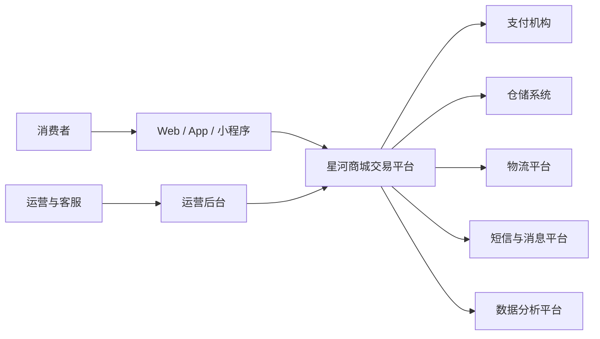
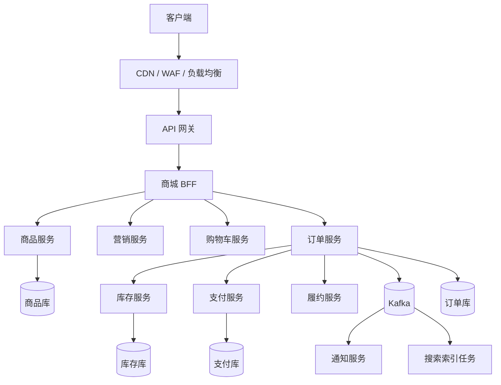
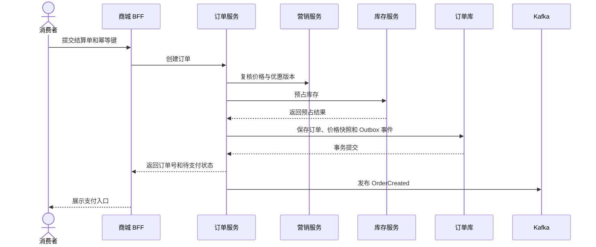
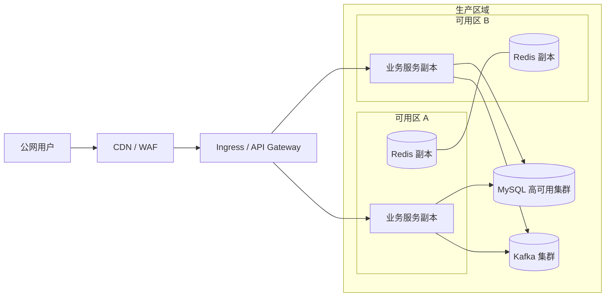

# 星河商城总体设计说明书

> 示例基线  
> 本文以虚构的 B2C 电商系统「星河商城」为样例。业务量、服务等级和恢复目标均为设计假设，用来演示文档应该如何形成闭环，不代表任何真实生产系统。正式项目应以批准后的需求、容量评估和演练结果替换这些数据。

本文回答系统边界、架构分解、关键链路、质量目标和主要取舍。类、方法、表字段、消息载荷和异常分支由《星河商城订单域详细设计说明书》继续展开。

## 文档控制

| 项目 | 示例值 |
|---|---|
| 文档编号 | XH-MALL-HLD-001 |
| 项目 | 星河商城一期建设 |
| 系统 | 星河商城交易平台 |
| 版本 | V1.0-draft |
| 状态 | 示例基线，待项目评审 |
| 责任角色 | 解决方案架构师 |
| 评审角色 | 产品、研发、测试、安全、数据、运维 |
| 对应需求基线 | XH-MALL-SRS-001 V1.0 |
| 配套详细设计 | XH-MALL-ORDER-DD-001 V1.0 |

### 修订记录

| 版本 | 日期 | 变更内容 | 评审状态 |
|---|---|---|---|
| V0.1 | 2026-07-22 | 建立电商系统总体设计样例 | 待评审 |

### 编制依据

- ISO/IEC/IEEE 42010 的架构描述、关注点和视图思想
- C4 模型的系统上下文、容器和组件表达
- arc42 的约束、质量目标、风险和架构决策结构
- OpenAPI 规范、OWASP ASVS 和组织内部安全基线

## 业务目标和设计边界

### 建设目标

星河商城面向个人消费者提供商品浏览、营销试算、购物车、结算、支付、履约查询和售后申请。首期目标是把交易主链路从活动流量中隔离出来，让商品访问可以横向扩展，同时保证订单、库存和支付结果可追踪、可补偿。

### 范围

| 范围内 | 范围外 |
|---|---|
| Web、移动应用和小程序交易入口 | 商家入驻、平台招商和广告投放 |
| 商品目录、价格、促销、购物车 | 仓库内部 WMS 作业 |
| 订单、库存预占、支付接入 | 支付机构内部清结算 |
| 发货状态、售后申请、通知 | 财务总账和税务申报 |
| 运营后台的订单查询和人工补偿 | 数据仓库完整指标体系 |

### 参与者

| 参与者 | 主要诉求 |
|---|---|
| 消费者 | 快速找到商品，稳定下单，及时获知订单状态 |
| 运营人员 | 配置商品和活动，查询订单，处理可控异常 |
| 客服人员 | 查询交易证据，发起取消、退款和补偿流程 |
| 仓储系统 | 接收履约单，回传出库和物流状态 |
| 支付机构 | 创建支付单，回调支付结果，受理退款 |
| 运维团队 | 发布、监控、扩容、故障处置和恢复 |

## 需求追踪

| 需求编号 | 需求摘要 | 总体设计响应 | 验证证据 |
|---|---|---|---|
| BR-001 | 用户可以浏览和搜索在售商品 | 商品域、搜索索引、CDN 和分级缓存 | 搜索相关性测试、浏览性能报告 |
| BR-002 | 用户提交订单时价格和优惠可复核 | 结算快照、订单价格明细、规则版本号 | 金额一致性用例、审计记录 |
| BR-003 | 同一库存不能重复售卖 | 库存预占、超时释放、幂等事件消费 | 并发库存测试、对账报告 |
| BR-004 | 支付回调重复到达不能重复记账 | 支付流水唯一约束、回调幂等键 | 重放测试、支付对账结果 |
| QR-001 | 核心交易月可用性目标 99.95% | 多副本、故障隔离、限流降级、跨可用区部署 | 可用性报表、故障演练记录 |
| QR-002 | 订单提交 P99 不高于 800 ms | 关键链路同步收敛，非关键动作事件化 | 压测报告、链路追踪 |
| QR-003 | 核心数据 RPO 不高于 5 分钟 | 数据库备份、日志持续归档、恢复演练 | 恢复演练报告 |

## 架构驱动因素

### 示例容量基线

| 指标 | 平日 | 活动峰值 | 设计说明 |
|---|---:|---:|---|
| 页面和 API 请求 | 2,000 RPS | 10,000 RPS | 浏览流量约占 85% |
| 创建订单 | 80 TPS | 500 TPS | 按十分钟活动峰值估算 |
| 支付结果事件 | 60 TPS | 450 TPS | 允许短时积压，必须可重放 |
| 商品数量 | 200 万 SKU | 300 万 SKU | 搜索索引与交易库分离 |
| 日增订单 | 30 万 | 120 万 | 热数据保留 12 个月 |

### 质量目标

| 优先级 | 质量属性 | 示例目标 |
|---:|---|---|
| 1 | 正确性 | 订单金额、库存和支付状态可对账，不以缓存结果作为交易事实 |
| 2 | 可用性 | 核心交易月可用性 99.95%，单实例故障不影响下单 |
| 3 | 性能 | 商品浏览 P99 不高于 300 ms，订单提交 P99 不高于 800 ms |
| 4 | 可恢复性 | 核心交易 RTO 不高于 30 分钟，RPO 不高于 5 分钟 |
| 5 | 可演进性 | 商品、交易、履约独立发布，公共契约保持向后兼容 |

### 关键约束

- 交易服务使用 Java 和 Spring Boot，运行在 Kubernetes 集群。
- 每个业务域拥有自己的数据表和写入入口，不跨服务直接写库。
- MySQL 保存交易事实，Redis 只承担缓存、短期令牌和热点读加速。
- Kafka 传递领域事件，消费者必须支持幂等、重试和死信处置。
- 外部支付、短信和物流接口通过适配层接入，不能把厂商报文字段扩散到核心模型。

## 系统上下文

系统负责从商品可售到订单履约状态回传的交易编排。支付机构、仓储和物流是外部系统，星河商城保存调用请求、结果和关联编号，但不替代外部系统的业务账本。

## 总体架构策略

### 领域分解

| 业务域 | 职责 | 事实数据 |
|---|---|---|
| 用户域 | 账号、地址、会员身份 | 用户、地址、会员状态 |
| 商品域 | SPU、SKU、类目、上下架 | 商品主数据、销售属性 |
| 营销域 | 价格、优惠券、活动试算 | 规则版本、优惠资格 |
| 购物车域 | 购物项、勾选和失效检查 | 用户购物车 |
| 订单域 | 结算快照、订单生命周期、取消 | 订单、订单项、状态历史 |
| 库存域 | 可售量、预占、扣减和释放 | 库存余额、预占记录 |
| 支付域 | 支付单、回调、退款和对账 | 支付流水、退款流水 |
| 履约域 | 履约单、出库和物流状态 | 履约任务、物流轨迹 |
| 通知域 | 站内信、短信和推送 | 通知任务、发送结果 |

### 一致性边界

订单创建只在订单库事务内提交订单和待发送事件。库存预占、支付和履约通过可追踪事件推进，不采用跨库分布式事务。每个跨域动作都定义幂等键、超时、重试上限、补偿入口和人工处置状态。

### 同步和异步边界

- 查询商品、试算价格、校验地址和创建订单采用同步 API。
- 库存预占结果在订单提交前同步确认，避免生成无法履行的订单。
- 通知、搜索索引更新、分析采集和非关键审计采用异步事件。
- 支付结果由回调和主动查询共同确认，回调不是唯一证据来源。

## 架构视图

### 逻辑视图

### 下单运行视图

### 部署视图

业务服务跨两个可用区部署，数据库和消息集群采用独立故障域。灾备目标以数据库日志归档和基础设施重建脚本为基础，恢复能力必须通过演练证明。

## 数据和接口原则

### 数据分层

| 数据类型 | 存储 | 规则 |
|---|---|---|
| 订单、库存、支付事实 | MySQL | 事务提交后才视为事实，保留状态历史 |
| 商品和活动热点读 | Redis | 允许失效和重建，不能覆盖事实库 |
| 商品检索文档 | OpenSearch | 从商品事件重建，接受秒级延迟 |
| 图片、导出文件 | 对象存储 | 私有桶、限时签名、生命周期管理 |
| 领域事件 | Kafka | 明确分区键、版本、保留期和重放规则 |

### 契约治理

- HTTP API 以 OpenAPI 文档为契约，字段新增保持向后兼容。
- 事件必须包含 eventId、eventType、occurredAt、aggregateId、schemaVersion 和 traceId。
- 金额使用最小货币单位的整数，时间使用带时区的 ISO 8601 表达。
- 客户端不得根据错误文本判断业务分支，只使用稳定错误码。

## 质量属性设计

### 可用性和降级

- 网关按租户、用户和接口执行限流，活动入口设置独立容量配额。
- 推荐、评论和通知异常时不阻断结算；价格、库存和支付异常时拒绝提交并返回可恢复提示。
- 外部接口使用超时、隔离舱和熔断策略，重试只用于明确可安全重放的请求。

### 性能和容量

- 商品页面采用 CDN、边缘缓存和服务端缓存三级加速。
- 订单写链路不依赖搜索、分析和通知服务。
- 大促前按目标峰值的 1.5 倍进行容量验证，并检查数据库连接、热点 SKU 和消息积压。

### 安全

- 所有外部流量经 WAF 和 API 网关，内部服务使用工作负载身份进行鉴权。
- 用户标识、地址和联系方式按敏感数据分级保护，日志不得记录完整明文。
- 支付回调验证签名、时间窗和商户订单号，并保留原始报文摘要供审计。
- 运营后台采用最小权限、强认证和高风险操作复核。

### 可观测性

每个请求携带 traceId。核心指标覆盖下单成功率、库存预占失败率、支付回调延迟、消息积压、数据库连接和订单状态停留时间。业务告警必须指向可执行的处置手册，避免只报 CPU 和内存。

## 发布、迁移和恢复

### 发布策略

- 数据库变更遵循先扩展、后迁移、再收缩，禁止新旧版本同时运行时破坏兼容。
- 业务服务按小流量、单可用区、全区域三步放量。
- 放量依据是错误率、延迟、订单成功率和对账差异，不以部署完成作为发布成功。

### 恢复策略

| 故障 | 恢复动作 | 验证点 |
|---|---|---|
| 单服务实例故障 | 自动摘除并重建副本 | 订单成功率无明显下降 |
| 单可用区故障 | 流量切到健康可用区 | 容量余量和依赖可用 |
| 数据误操作 | 时间点恢复到隔离实例，核对后回切 | RPO、订单数和账实一致 |
| 消息误消费 | 停止消费者，修正规则后按事件号重放 | 无重复业务副作用 |

## 关键架构决策

| ADR | 决策 | 理由 | 代价 |
|---|---|---|---|
| ADR-001 | 按业务域拆分服务和数据所有权 | 隔离高频浏览与核心交易，明确变更责任 | 服务和契约治理成本增加 |
| ADR-002 | 采用本地事务加 Outbox 发布订单事件 | 保证订单事实和待发布事件同事务提交 | 需要投递任务、去重和积压监控 |
| ADR-003 | 库存使用预占、确认、释放模型 | 支持支付窗口和取消补偿 | 必须处理超时释放和对账 |
| ADR-004 | 搜索索引不参与交易事实判断 | 搜索可独立扩展和重建 | 商品变更存在短暂可见延迟 |

## 风险和待决事项

| 编号 | 风险或待决事项 | 当前控制 | 关闭条件 |
|---|---|---|---|
| R-001 | 热门 SKU 形成库存热点 | 分片键评审、限购、排队削峰 | 峰值压测达到目标且无超卖 |
| R-002 | 支付回调延迟或丢失 | 主动查单、对账和人工补偿 | 故障演练覆盖重复、乱序和延迟 |
| R-003 | 活动规则复杂导致价格不一致 | 规则版本和结算快照 | 前后端、订单和退款金额一致性用例通过 |
| D-001 | 灾备部署级别尚未由业务批准 | 提供成本和恢复目标对比 | 业务负责人批准最终 RTO 与 RPO |

## 评审检查表

- [ ] 系统边界、外部系统和责任归属没有歧义
- [ ] 每项架构驱动因素都有设计响应和验证证据
- [ ] 交易事实、缓存、索引和事件的权威来源清楚
- [ ] 同步调用、异步事件、超时和补偿边界完整
- [ ] 安全、容量、可观测性、发布和恢复方案可执行
- [ ] 关键决策记录了替代方案、代价和复审条件
- [ ] 风险与待决事项有责任角色和关闭条件

## 参考资料

- [ISO/IEC/IEEE 42010 架构描述标准](https://www.iso.org/standard/74393.html)
- [C4 model diagrams](https://c4model.com/diagrams)
- [arc42 documentation](https://docs.arc42.org/home/)
- [OpenAPI Specification](https://spec.openapis.org/oas/latest.html)
- [OWASP Application Security Verification Standard](https://owasp.org/www-project-application-security-verification-standard/)
