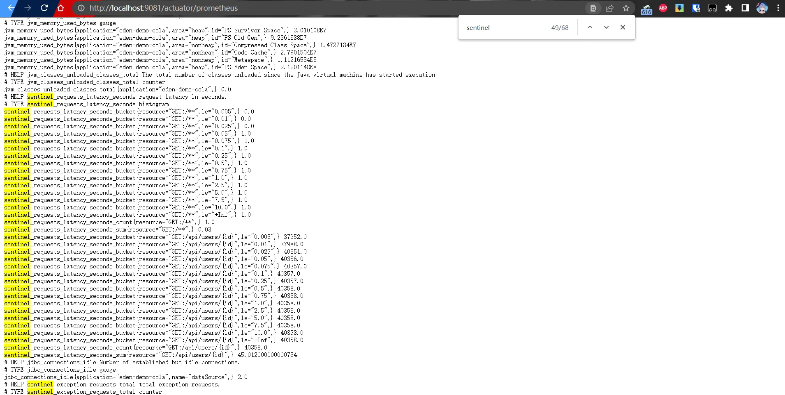
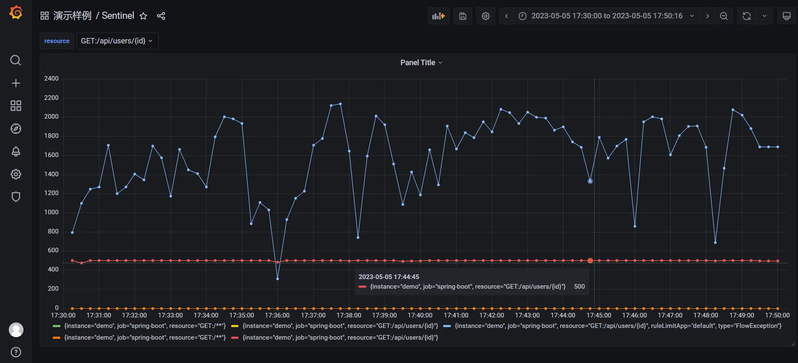

# 设计思路

Sentinel 提供了 MetricExtension 作为 SPI 扩展点，在官方的 [PR](https://github.com/alibaba/Sentinel/pull/735) 有相关说明。

源码如下：

```java
package com.alibaba.csp.sentinel.metric.extension;

import com.alibaba.csp.sentinel.slots.block.BlockException;

public interface MetricExtension {

    void addPass(String resource, int n, Object... args);

    void addBlock(String resource, int n, String origin, BlockException blockException, Object... args);

    void addSuccess(String resource, int n, Object... args);

    void addException(String resource, int n, Throwable throwable);

    void addRt(String resource, long rt, Object... args);

    void increaseThreadNum(String resource, Object... args);

    void decreaseThreadNum(String resource, Object... args);
}
```

Sentinel 客户端执行 onPass 或者 onBlock 方法会调用到这个扩展点。

```java
public class MetricEntryCallback implements ProcessorSlotEntryCallback<DefaultNode> {

    @Override
    public void onPass(Context context, ResourceWrapper rw, DefaultNode param, int count, Object... args)
    throws Exception {
        for (MetricExtension m : MetricExtensionProvider.getMetricExtensions()) {
            if (m instanceof AdvancedMetricExtension) {
                ((AdvancedMetricExtension) m).onPass(rw, count, args);
            } else {
                m.increaseThreadNum(rw.getName(), args);
                m.addPass(rw.getName(), count, args);
            }
        }
    }

    @Override
    public void onBlocked(BlockException ex, Context context, ResourceWrapper resourceWrapper, DefaultNode param,
                          int count, Object... args) {
        for (MetricExtension m : MetricExtensionProvider.getMetricExtensions()) {
            if (m instanceof AdvancedMetricExtension) {
                ((AdvancedMetricExtension) m).onBlocked(resourceWrapper, count, context.getOrigin(), ex, args);
            } else {
                m.addBlock(resourceWrapper.getName(), count, context.getOrigin(), ex, args);
            }
        }
    }
}
```

因此，在 MetricExtension 集成 Prometheus 客户端即可。

# 实现步骤

## 引入 Prometheus 依赖

```xml
<!-- Prometheus -->
<dependency>
  <groupId>io.prometheus</groupId>
  <artifactId>simpleclient</artifactId>
  <version>0.16.0</version>
</dependency>
<!-- Sentinel -->
<dependency>
  <groupId>com.alibaba.csp</groupId>
  <artifactId>sentinel-core</artifactId>
  <optional>true</optional>
</dependency>
<dependency>
  <groupId>com.alibaba.csp</groupId>
  <artifactId>sentinel-datasource-extension</artifactId>
  <optional>true</optional>
</dependency>
<dependency>
  <groupId>com.alibaba.csp</groupId>
  <artifactId>sentinel-transport-simple-http</artifactId>
  <optional>true</optional>
</dependency>
```

## 定义 SPI 扩展点

Sentinel 提供了标准的 SPI 扩展，在目录 `src/main/resources/META-INF/services` 创建 `com.alibaba.csp.sentinel.metric.extension.MetricExtension` 文件。

```java
com.xxx.spi.PrometheusMetricExtension
```

创建 PrometheusMetricExtension 类。

```java
import com.alibaba.csp.sentinel.metric.extension.MetricExtension;
import com.alibaba.csp.sentinel.slots.block.BlockException;
import org.ylzl.eden.spring.framework.beans.ApplicationContextHelper;

/**
 * Sentinel 监控扩展点实现
 *
 * @author <a href="mailto:shiyindaxiaojie@gmail.com">gyl</a>
 * @since 2.4.x
 */
public class PrometheusMetricExtension implements MetricExtension {

    private SentinelCollectorRegistry registry;

    private SentinelCollectorRegistry getRegistry() {
        if (registry != null) {
            return registry;
        }
        this.registry = ApplicationContextHelper.getBean(SentinelCollectorRegistry.class);
        return registry;
    }

    @Override
    public void addPass(String resource, int n, Object... args) {
        getRegistry().getPassRequests().labels(resource).inc(n);
    }

    @Override
    public void addBlock(String resource, int n, String origin, BlockException ex, Object... args) {
        getRegistry().getBlockRequests().labels(resource, ex.getClass().getSimpleName(), ex.getRuleLimitApp(), origin).inc(n);
    }

    @Override
    public void addSuccess(String resource, int n, Object... args) {
        getRegistry().getSuccessRequests().labels(resource).inc(n);
    }

    @Override
    public void addException(String resource, int n, Throwable throwable) {
        getRegistry().getExceptionRequests().labels(resource).inc(n);
    }


    @Override
    public void addRt(String resource, long rt, Object... args) {
        getRegistry().getRtHist().labels(resource).observe(((double)rt) / 1000);
    }

    @Override
    public void increaseThreadNum(String resource, Object... args) {
    	getRegistry().getCurrentThreads().labels(resource).inc();
    }

    @Override
    public void decreaseThreadNum(String resource, Object... args) {
    	getRegistry().getCurrentThreads().labels(resource).dec();
    }
}
```

创建 Prometheus 客户端注册类。

```java
@Getter
public class SentinelCollectorRegistry {

	private Counter passRequests;

	private Counter blockRequests;

	private Counter successRequests;

	private Counter exceptionRequests;

	private Histogram rtHist;

	private Gauge currentThreads;

	public SentinelCollectorRegistry(CollectorRegistry registry) {
		passRequests = Counter.build()
			.name("sentinel_pass_requests_total")
			.help("total pass requests.")
			.labelNames("resource")
			.register(registry);
		blockRequests = Counter.build()
			.name("sentinel_block_requests_total")
			.help("total block requests.")
			.labelNames("resource", "type", "ruleLimitApp", "limitApp")
			.register(registry);
		successRequests = Counter.build()
			.name("sentinel_success_requests_total")
			.help("total success requests.")
			.labelNames("resource")
			.register(registry);
		exceptionRequests = Counter.build()
			.name("sentinel_exception_requests_total")
			.help("total exception requests.")
			.labelNames("resource")
			.register(registry);
		currentThreads = Gauge.build()
			.name("sentinel_current_threads")
			.help("current thread count.")
			.labelNames("resource")
			.register(registry);
		rtHist = Histogram.build()
			.name("sentinel_requests_latency_seconds")
			.help("request latency in seconds.")
			.labelNames("resource")
			.register(registry);
	}
}
```

将相关组件注册到 Spring Bean。

```java
package org.ylzl.eden.sentinel.spring.cloud.autoconfigure;

import io.prometheus.client.CollectorRegistry;
import lombok.extern.slf4j.Slf4j;
import org.springframework.beans.factory.config.BeanDefinition;
import org.springframework.boot.actuate.autoconfigure.metrics.MetricsAutoConfiguration;
import org.springframework.boot.actuate.autoconfigure.metrics.export.ConditionalOnEnabledMetricsExport;
import org.springframework.boot.actuate.autoconfigure.metrics.export.prometheus.PrometheusMetricsExportAutoConfiguration;
import org.springframework.boot.autoconfigure.AutoConfigureAfter;
import org.springframework.boot.autoconfigure.AutoConfigureBefore;
import org.springframework.boot.autoconfigure.condition.ConditionalOnClass;
import org.springframework.boot.autoconfigure.condition.ConditionalOnProperty;
import org.springframework.context.annotation.Bean;
import org.springframework.context.annotation.Configuration;
import org.springframework.context.annotation.Role;
import org.ylzl.eden.spring.cloud.sentinel.prometheus.SentinelCollectorRegistry;

/**
 * Sentinel 集成 Prometheus 自动装配
 *
 * @author <a href="mailto:shiyindaxiaojie@gmail.com">gyl</a>
 * @since 2.4.13
 */
@AutoConfigureBefore({ PrometheusMetricsExportAutoConfiguration.class })
@AutoConfigureAfter(MetricsAutoConfiguration.class)
@ConditionalOnClass(CollectorRegistry.class)
@ConditionalOnEnabledMetricsExport("prometheus")
@ConditionalOnProperty(name = "spring.cloud.sentinel.enabled", matchIfMissing = true)
@Slf4j
@Role(BeanDefinition.ROLE_INFRASTRUCTURE)
@Configuration(proxyBeanMethods = false)
public class SentinelPrometheusAutoConfiguration {

	public static final String AUTOWIRED_SENTINEL_COLLECTOR_REGISTRY = "Autowired SentinelCollectorRegistry";

	@Bean
	public SentinelCollectorRegistry sentinelCollectorRegistry(CollectorRegistry registry) {
		log.debug(AUTOWIRED_SENTINEL_COLLECTOR_REGISTRY);
		return new SentinelCollectorRegistry(registry);
	}
}
```

## 验证 Actuator 端点

启动项目，访问 /actuator/prometheus 端点。



## 配置 Grafana 可视化




