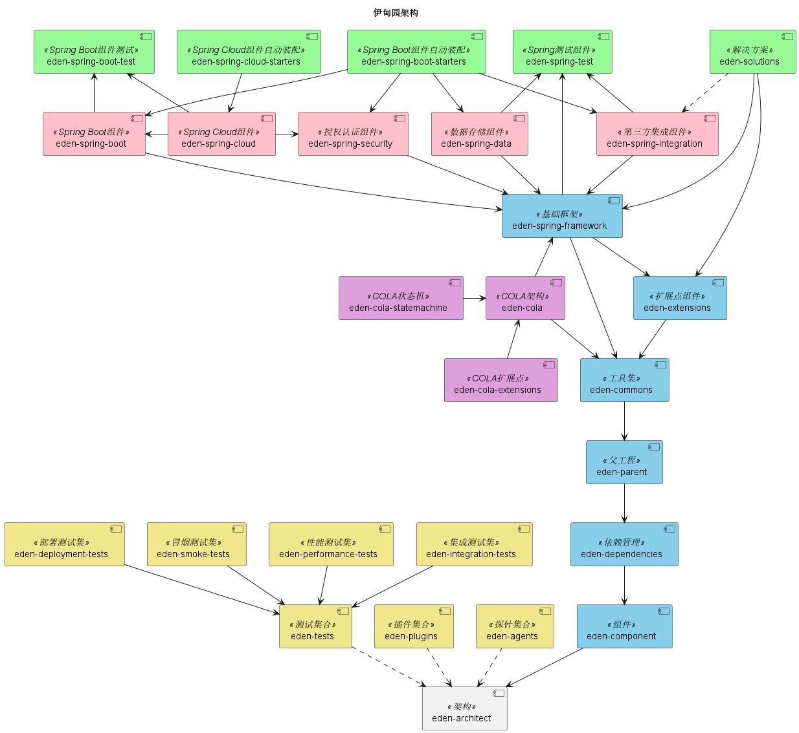

# Eden* Architect

[](https://github.com/shiyindaxiaojie/eden-architect)
[](https://github.com/shiyindaxiaojie/eden-architect/actions)
[](https://www.apache.org/licenses/LICENSE-2.0.html)
[](https://sonarcloud.io/dashboard?id=shiyindaxiaojie_eden-architect)

<p>
  <strong>企业级分布式应用一站式解决方案</strong>
</p>

简体中文 | [English](./README.md)

---

## 📖 简介

**Eden* Architect** 致力于为企业开发提供一站式的解决方案。它封装了构建分布式应用服务所需的各类必选组件。您只需要简单的注解和少量的配置，即可将 Spring Boot 应用接入微服务生态，并利用我们强大的中间件能力迅速搭建稳定可靠的分布式系统。

> 📚 详细文档请查看 [WIKI](https://github.com/shiyindaxiaojie/eden-architect/wiki)。

## ✨ 功能特性

- **📦 统一依赖管理**: 集中管理依赖版本，彻底解决依赖 conflict 问题；封装常用插件，显著减少构建时间。
- **🛠️ 组件深度集成**: 在 Spring 官方基础上扩展，开箱即用集成 `XxlJob`、`CAT`、`Netty`、`Arthas` 等主流组件。
- **🔌 灵活扩展点**: 针对消息队列、缓存、短信、邮件、Excel 等技术提供高度抽象的扩展接口，支持动态适配。
- **💡 通用解决方案**: 提供`多级缓存`、`分布式锁`、`分布式唯一ID`、`幂等性`、`审计日志`、`最终一致性`、`全链路追踪` 等企业级解决方案。

## 🏗️ 架构概览

<div align="center">
  
</div>

### 组件构成

| 组件名称 | 说明 |
|-----------|-------------|
| **eden-dependencies** | 依赖管理组件，统一管控全局依赖版本。 |
| **eden-parent** | 构建管理组件，封装常用插件，提供开箱即用的构建配置。 |
| **eden-commons** | 基础工具组件，扩展了 `Apache Commons` 和 `Google Guava`。 |
| **eden-extensions** | 扩展点组件，参考 `Dubbo` SPI 机制实现的轻量级扩展框架。 |
| **eden-cola** | 优化版 `COLA` 组件，完善了 DDD 领域模型、状态机及业务扩展点支持。 |
| **eden-solutions** | 解决方案工具集，涵盖 `缓存`、`锁`、`去重`、`审计` 等场景实现。 |
| **eden-spring-framework** | 基础框架组件，支持自定义错误码及异常解析机制。 |
| **eden-spring-data** | 数据存储扩展，支持 `Mybatis`、`Redis`、`Flyway`、`Liquibase` 等。 |
| **eden-spring-security** | 安全认证扩展，支持 `OAuth2`、`Jwt`、`Shiro` 等。 |
| **eden-spring-integration** | 第三方集成扩展，支持 `RocketMQ`、`Kafka`、`Netty`、`XxlJob`。 |
| **eden-spring-cloud** | 微服务组件扩展，支持 `Nacos`、`Sentinel`、`Zookeeper` 等。 |

## 🚀 快速开始

### 环境准备

由于 `Spring Boot 2.4.x` 和 `3.0.x` 架构差异较大，我们维护了与 Spring Boot 版本一致的分支：

- **2.4.x 分支**: 适用于 `Spring Boot 2.4.x` (JDK 1.8+)
- **2.7.x 分支**: 适用于 `Spring Boot 2.7.x` (JDK 11+)
- **3.0.x 分支**: 适用于 `Spring Boot 3.0.x` (JDK 17+)

### 安装

克隆项目并安装到本地 Maven 仓库：

```bash
git clone https://github.com/shiyindaxiaojie/eden-architect.git
cd eden-architect
./mvnw install -T 4C
```

### 使用指南

1. **引入父工程**:
   在您项目的 `pom.xml` 中引入 `eden-parent`。

   ```xml
   <parent>
       <groupId>io.github.shiyindaxiaojie</groupId>
       <artifactId>eden-parent</artifactId>
       <version>0.0.1-SNAPSHOT</version>
       <relativePath/>
   </parent>
   ```

2. **添加依赖**:
   按需引入 Starter 组件（例如集成 CAT 监控）。

   ```xml
   <dependencies>
       <dependency>
           <groupId>io.github.shiyindaxiaojie</groupId>
           <artifactId>eden-cat-spring-boot-starter</artifactId>
       </dependency>
   </dependencies>
   ```
   *> 注：版本号已由 `eden-parent` 统一管理，无需手动指定。*

3. **配置参数**:
   在 `application.yml` 中开启相关功能。

   ```yaml
   cat:
     enabled: true # 开启 CAT
     trace-mode: true
     servers: localhost
   ```

4. **启动运行**:
   启动应用后，发起 HTTP 请求，即可在 CAT 控制台查看全链路追踪数据。

   

## 🧩 代码演示

我们提供三种不同架构风格的示例项目，供您参考：

- **[eden-demo-cola](https://github.com/shiyindaxiaojie/eden-demo-cola)**: 面向领域模型的 **COLA 架构**。
- **[eden-demo-layer](https://github.com/shiyindaxiaojie/eden-demo-layer)**: 传统的面向数据模型 **分层架构**。
- **[eden-demo-mvc](https://github.com/shiyindaxiaojie/eden-demo-mvc)**: 简单的 **MVC 架构**，适用于单体应用。

## 📅 版本规范

遵循语义化版本规范 `x.y.z`：
- **x**: 主版本号 (0 表示孵化阶段)。
- **y**: 次版本号 (功能迭代)。
- **z**: 修订号 (Bug 修复)。

## 📝 变更日志

详细变更记录请参阅 [CHANGELOG.md](https://github.com/shiyindaxiaojie/eden-architect/blob/main/CHANGELOG.md)。

## 📄 开源协议

本项目采用 [Apache-2.0 License](https://www.apache.org/licenses/LICENSE-2.0.html) 协议开源。
