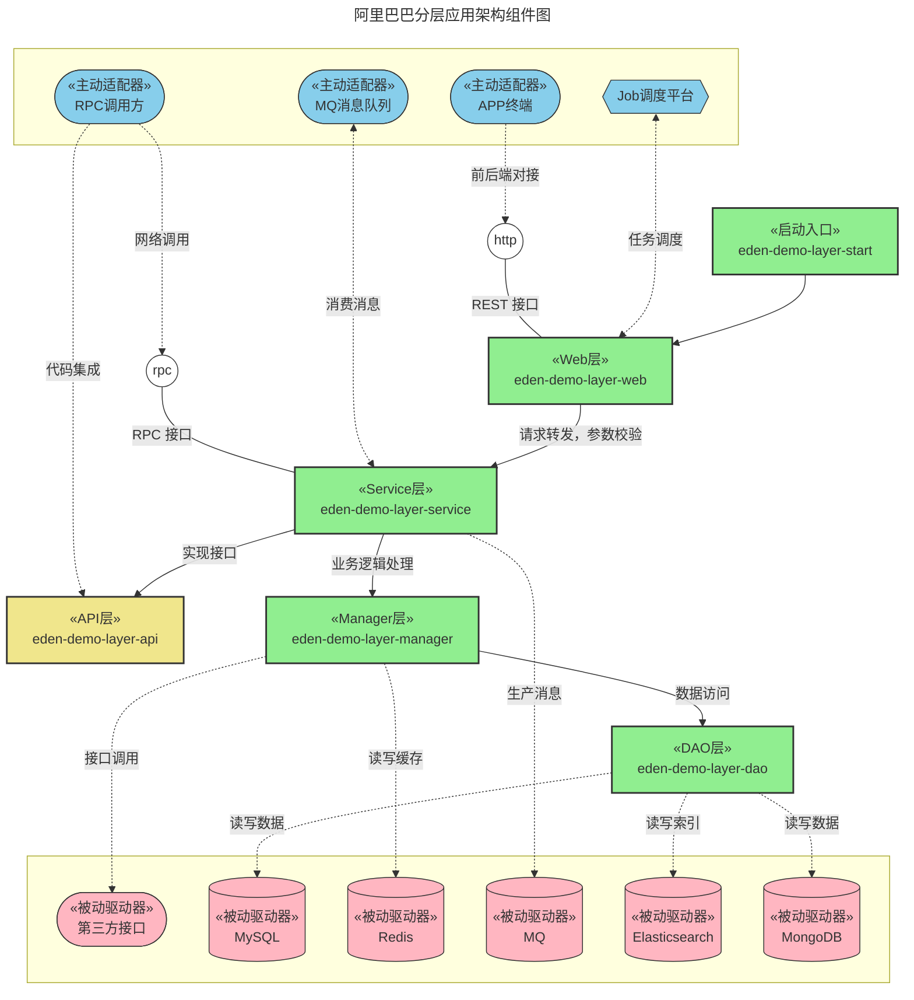
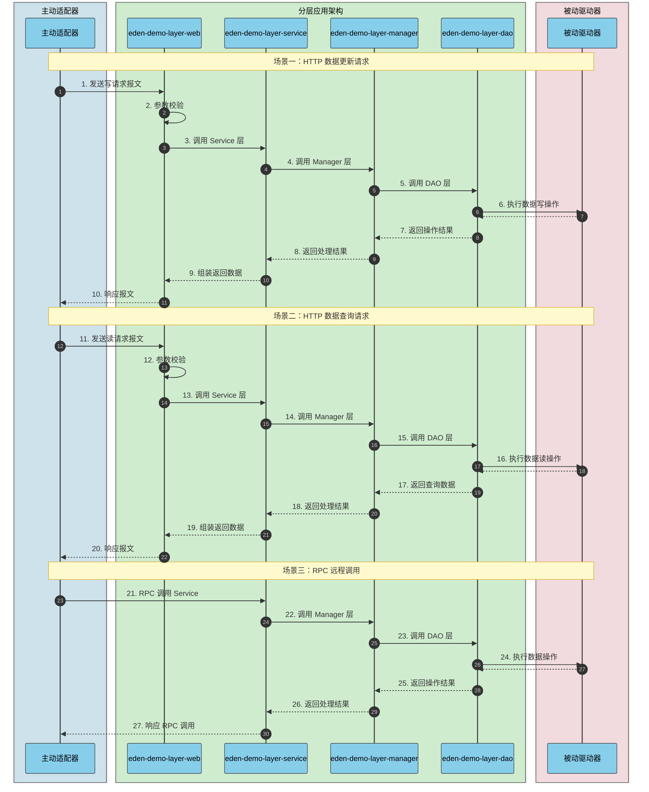
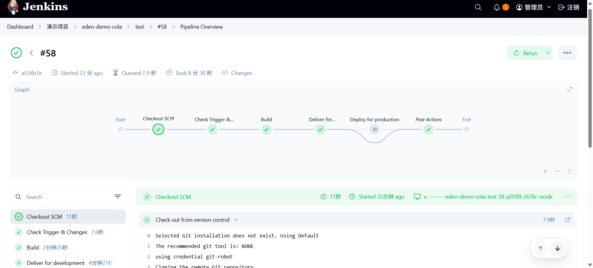
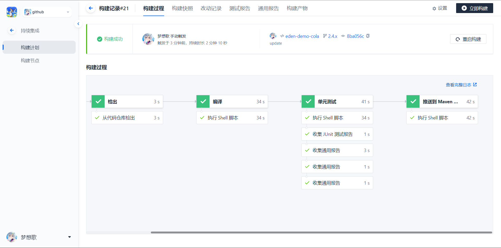
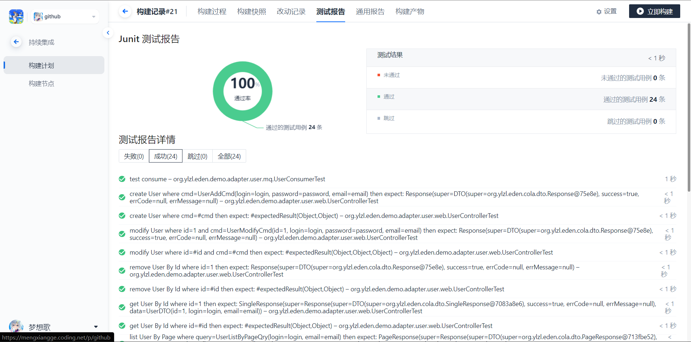
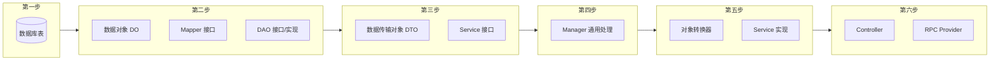
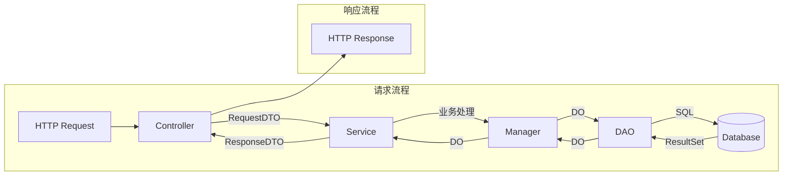
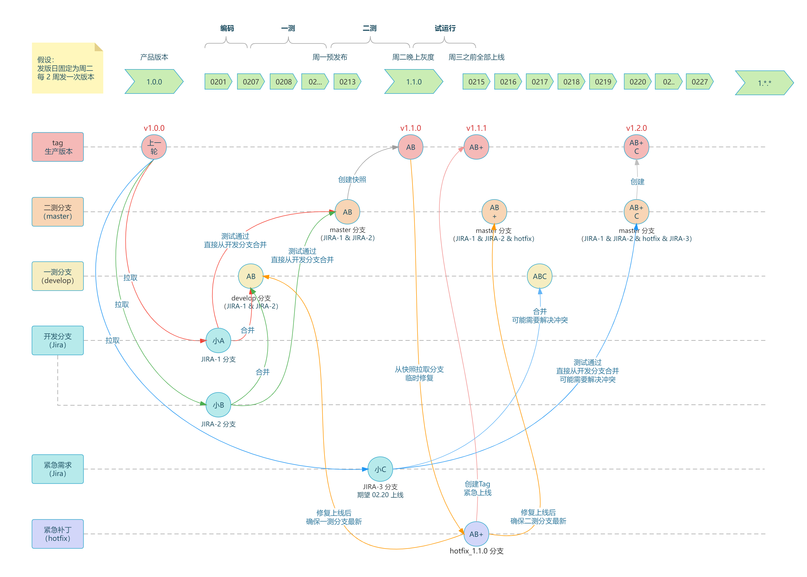
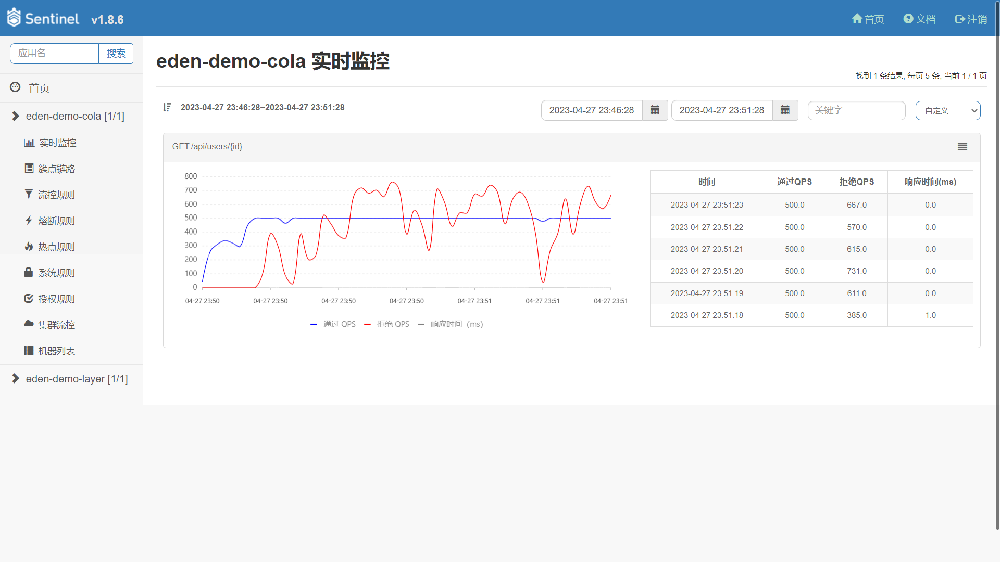
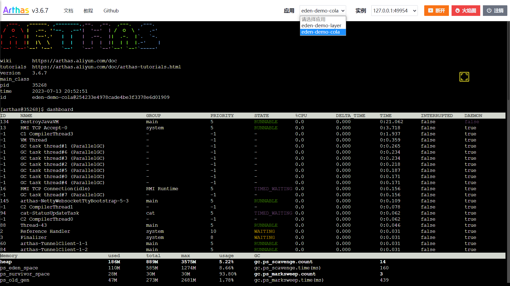

# 分层架构

[](https://github.com/shiyindaxiaojie/eden-demo-layer)
[](https://github.com/shiyindaxiaojie/eden-demo-layer/actions)
[](https://www.apache.org/licenses/LICENSE-2.0.html)
[](https://sonarcloud.io/dashboard?id=shiyindaxiaojie_eden-demo-layer)

<p>
  <strong>经典的、面向数据模型的分层应用架构</strong>
</p>

简体中文 | [English](./README.md)

---

本项目使用分层架构构建，分层架构是《阿里巴巴 Java 开发手册》推荐使用的一种面向数据模型的架构风格，默认上层依赖于下层，例如 `Web` 层依赖 `Service` 层、`Service` 层又依赖 `DAO` 层，在垂直业务领域能够满足单一职责原则，通过 `Maven` 多模块化的开发模式，可以帮助降低复杂应用场景的系统熵值，提升系统开发和运维效率。具体可以查阅 [WIKI](https://github.com/shiyindaxiaojie/eden-demo-layer/wiki) 。

## 文档指南

📚 详细的组件集成指南，请参阅文档：

- [中文文档](./docs/zh-CN/README.md) - 中文组件集成指南
- [English Documentation](./docs/en/README.md) - Component integration guides in English

文档涵盖以下内容：
- 快速开始指南
- 注册配置中心（Nacos）
- 缓存组件（Redis）
- 数据源组件（MySQL、Liquibase、ShardingSphere、Dynamic-Datasource）
- 消息队列组件（RocketMQ、Kafka、Dynamic-MQ）
- 监控观测组件（CAT、Jaeger、Zipkin、Sentinel、Arthas）
- RPC 组件（Dubbo、Dynamic-TP）
- 任务调度组件（XXL-Job）

## 组件构成



* **eden-demo-layer-web**：Web 层，请求处理层，对访问控制进行转发，各类基本参数校验，或者不复用的业务简单处理等。
* **eden-demo-layer-service**：Service 层，业务逻辑服务层，核心业务实现。
* **eden-demo-layer-api**：API 层，对外以 `jar` 包的形式提供接口定义（DTO、Service 接口）。
* **eden-demo-layer-manager**：Manager 层，通用业务处理层，对第三方平台进行接口封装，对 `Service` 层通用能力的下沉，如缓存方案、中间件通用处理，与 `DAO` 层交互，对多个 `DAO` 的组合复用。
* **eden-demo-layer-dao**：DAO 层，数据持久层，与底层 `MySQL`、`Elasticsearch`、`MongoDB` 等进行数据交互。
* **eden-demo-layer-start**：程序启动入口，统一管理应用的配置和交付。

## 运行流程



## 如何构建

由于 `Spring Boot 2.4.x` 和 `Spring Boot 3.0.x` 在架构层面有很大的变更，因此笔者采取跟 Spring Boot 版本号一致的分支:

* 2.4.x 分支适用于 `Spring Boot 2.4.x`，最低支持 JDK 1.8。
* 2.7.x 分支适用于 `Spring Boot 2.7.x`，最低支持 JDK 11。
* 3.0.x 分支适用于 `Spring Boot 3.0.x`，最低支持 JDK 17。

本项目默认使用 Maven 来构建，最快的使用方式是 `git clone` 到本地。为了简化不必要的技术细节，本项目依赖 [eden-architect](https://github.com/shiyindaxiaojie/eden-architect)，在项目的根目录执行 `mvn install -T 4C` 完成本项目的构建。

## 如何启动

### 快速体验

本项目默认设置了 dev 运行环境，为了方便您直接启动项目，所有外部的组件依赖均为关闭状态。

1. 在项目目录下运行 `mvn install`（如果不想运行测试，可以加上 `-DskipTests` 参数）。
2. 进入 `eden-demo-layer-start` 目录，执行 `mvn spring-boot:run` 或者启动 `LayerApplication` 类。运行成功的话，可以看到 `Spring Boot` 启动成功的界面。
3. 本应用中已经实现了一个简单的 `RestController` 接口，可以点击 [演示接口](http://localhost:8082/api/users/1) 进行调试。
4. 由于目前的主流是前后端分离开发，请按需实现页面。访问 [http://localhost:8082](http://localhost:8082) 将跳转到 404 页面。


### 微调配置

**开启注册中心和配置管理**：推荐使用 `Nacos` 组件，您可以查阅 [Nacos Quick Start](https://nacos.io/zh-cn/docs/quick-start.html) 快速搭建，请根据您的 Nacos 地址修改配置文件：[bootstrap-dev.yml](https://github.com/shiyindaxiaojie/eden-demo-layer/blob/main/eden-demo-layer-start/src/main/resources/config/bootstrap-dev.yml)，调整以下内容：

```yaml
spring:
  cloud:
    nacos:
      discovery: # 注册中心
        enabled: true # 默认关闭，请按需开启
      config: # 配置中心
        enabled: true # 默认关闭，请按需开启
```

**修改默认的数据源**：本项目默认使用 `H2` 内存数据库启动，基于 `Liquibase` 在项目启动时自动初始化 SQL 脚本。如果您使用的是外部的 MySQL 数据库，可以从此处调整下数据库的连接信息：[application-dev.yml](https://github.com/shiyindaxiaojie/eden-demo-layer/blob/main/eden-demo-layer-start/src/main/resources/config/application-dev.yml)，请删除任何与 `H2` 有关的配置。

```yaml
spring:
#  h2: # 内存数据库
#    console:
#      enabled: true # 线上环境请勿设置
#      path: /h2-console
#      settings:
#        trace: false
#        web-allow-others: false
  datasource: # 数据源管理
    username: 
    password: 
    url: jdbc:mysql://host:port/schema?rewriteBatchedStatements=true&useSSL=false&useOldAliasMetadataBehavior=true&useUnicode=true&serverTimezone=GMT%2B8
    driver-class-name: com.mysql.cj.jdbc.Driver
```

此外，本项目还罗列了 `Redis` 缓存、`RocketMQ` 消息队列、`ShardingSphere` 分库分表等常用组件的使用方案，默认通过 `xxx.enabled` 关闭自动配置。您可以根据实际情况开启配置，直接完成组件的集成。

## 如何部署

### FatJar 简易部署

执行 `mvn -T 4C clean package` 打包成一个可运行的 fat jar，参考如下命令启动编译后的控制台。

```bash
java -Dserver.port=8082 -jar target/eden-demo-layer-start.jar
```

### Assembly 打包部署

执行 `mvn -P assembly -T 4C clean package` 打包成压缩包，选择下列压缩包复制一份到您期望部署的目录。

* target/eden-demo-layer-start-assembly.zip
* target/eden-demo-layer-start-assembly.tar.gz

解压文件后，您可以在 `bin` 目录下找到 `startup.sh` 或者 `startup.bat`脚本，直接运行即可。

### Jib 镜像部署

Google Jib 插件允许您在没有安装 Docker 下完成镜像的构建。

```bash
mvn -T 4C -U package
mvn -pl eden-demo-layer-start jib:build -Djib.disableUpdateChecks=true -DskipTests
```

### Docker 容器部署

基于 Spring Boot 的分层特性构建镜像，请确保正确安装了 Docker 工具，然后执行以下命令。

```bash
docker build -f docker/Dockerfile -t eden-demo-layer:{tag} .
```

### Helm 应用部署

以应用为中心，建议使用 Helm 统一管理所需部署的 K8s 资源描述文件，请参考以下命令完成应用的安装和卸载。

```bash
helm install eden-demo-layer ./helm # 部署资源
helm uninstall eden-demo-layer # 卸载资源
```

## 持续集成

> CI/CD 工具选型：Jenkins、CODING、Codeup、Zadig、KubeVela

### Jenkins 持续集成

下图演示基于 Jenkins 实现持续构建、持续部署的效果。



### CODING 持续集成

下图演示基于 CODING 实现持续构建、持续部署的效果。[传送门](https://mengxiangge.netlify.app/2022/08/10/devops/coding%20%E6%8C%81%E7%BB%AD%E9%83%A8%E7%BD%B2%E5%AE%9E%E8%B7%B5/?highlight=coding)





## 最佳实践

### 分层架构开发流程

本项目展示如何在分层架构中进行功能开发，以下是推荐的开发流程和各层职责说明。

**开发流程**

按照自底向上的顺序进行开发，确保每一层的依赖都已就绪：



**各层职责与代码示例**

| 层级 | 职责 | 代码位置 | 命名规范 |
|------|------|----------|----------|
| DAO 层 | 数据持久化，与数据库交互 | `eden-demo-layer-dao` | `XxxDO`, `XxxMapper`, `XxxDAO` |
| API 层 | 对外接口定义，DTO 定义 | `eden-demo-layer-api` | `XxxService`, `XxxDTO` |
| Manager 层 | 通用业务处理，DAO 组合复用 | `eden-demo-layer-manager` | `XxxManager` |
| Service 层 | 核心业务逻辑实现 | `eden-demo-layer-service` | `XxxServiceImpl`, `XxxConvertor` |
| Web 层 | REST API 入口，参数校验 | `eden-demo-layer-web` | `XxxController` |

**代码结构示例**

以角色管理为例，展示各层的代码组织：

```
eden-demo-layer/
├── eden-demo-layer-dao/                    # DAO 层
│   └── src/main/java/org/ylzl/eden/demo/dao/
│       ├── database/
│       │   ├── dataobject/
│       │   │   └── RoleDO.java             # 数据对象
│       │   └── mapper/
│       │       └── RoleMapper.java         # MyBatis Mapper
│       ├── RoleDAO.java                    # DAO 接口
│       └── impl/
│           └── RoleDAOImpl.java            # DAO 实现
│
├── eden-demo-layer-api/                    # API 层
│   └── src/main/java/org/ylzl/eden/demo/api/
│       ├── RoleService.java                # Service 接口
│       └── dto/
│           ├── RoleRequestDTO.java         # 请求 DTO
│           └── RoleResponseDTO.java        # 响应 DTO
│
├── eden-demo-layer-manager/                # Manager 层
│   └── src/main/java/org/ylzl/eden/demo/manager/
│       └── dao/
│           └── RbacManager.java            # 通用业务处理
│
├── eden-demo-layer-service/                # Service 层
│   └── src/main/java/org/ylzl/eden/demo/service/
│       ├── converter/
│       │   └── RoleConvertor.java          # 对象转换器
│       ├── impl/
│       │   └── RoleServiceImpl.java        # Service 实现
│       └── rpc/
│           └── RoleProvider.java           # RPC 服务提供者
│
└── eden-demo-layer-web/                    # Web 层
    └── src/main/java/org/ylzl/eden/demo/web/
        └── RoleController.java             # REST Controller
```

**分层设计原则**

| 原则 | 说明 | 示例 |
|------|------|------|
| 单向依赖 | 上层依赖下层，禁止反向依赖 | Web → Service → DAO 或 Web → Service → Manager → DAO |
| 接口隔离 | API 层定义接口，Service 层实现 | `RoleService` 接口在 API 层，`RoleServiceImpl` 在 Service 层 |
| 对象转换 | 各层使用独立的数据对象 | DO ↔ DTO 通过 Convertor 转换 |
| 通用下沉 | 可复用逻辑下沉到 Manager 层 | 缓存处理、第三方调用、多 DAO 组合 |
| 事务边界 | 事务控制在 Service 层 | `@Transactional` 注解在 ServiceImpl |

**数据流转**



### Git 多人协作分支管理

在敏捷开发盛行的时代，`GitFlow` 显得力不从心，笔者为团队制定了一套简单易用的流程。[传送门](https://www.processon.com/view/63d5d1fc56e18032d4a00998)



### CAT 可观测性方案

通过 `TraceId` 分析整个链路的 `HTTP` 请求耗时、`RPC` 调用情况、`Log` 业务日志、`SQL` 和 `Cache` 执行耗时。[传送门](https://github.com/shiyindaxiaojie/cat)


### Sentinel 流量治理方案

根据业务负载配置您的流控规则，并允许在任意时刻查看接口的 QPS 和限流情况。[传送门](https://github.com/shiyindaxiaojie/Sentinel)



### Arthas 在线诊断工具

使用动态时运行探针，自动发现服务，开箱即用，允许在低负载环境诊断你的应用。[传送门](https://github.com/shiyindaxiaojie/arthas)



## 版本规范

项目的版本号格式为 `x.y.z` 的形式，其中 x 的数值类型为数字，从 0 开始取值，且不限于 0~9 这个范围。项目处于孵化器阶段时，第一位版本号固定使用 0，即版本号为 `0.x.x` 的格式。

* 孵化版本：0.0.1-SNAPSHOT
* 开发版本：1.0.0-SNAPSHOT
* 发布版本：1.0.0

版本迭代规则：

* 1.0.0 <> 1.0.1：兼容
* 1.0.0 <> 1.1.0：基本兼容
* 1.0.0 <> 2.0.0：不兼容

## 变更日志

请查阅 [CHANGELOG.md](https://github.com/shiyindaxiaojie/eden-demo-layer/blob/main/CHANGELOG.md)
