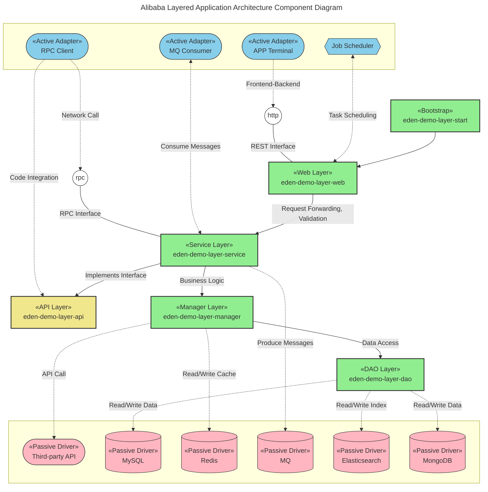
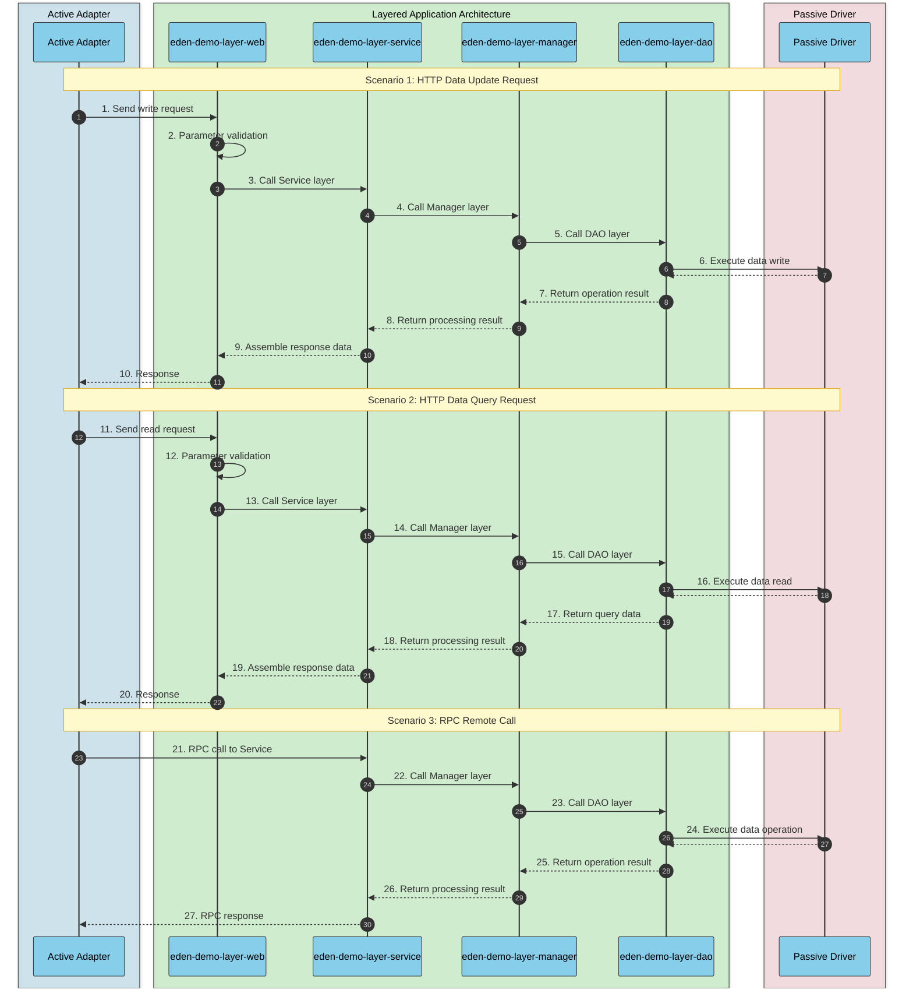

# Layered Architecture

[](https://github.com/shiyindaxiaojie/eden-demo-layer)
[](https://github.com/shiyindaxiaojie/eden-demo-layer/actions)
[](https://www.apache.org/licenses/LICENSE-2.0.html)
[](https://sonarcloud.io/dashboard?id=shiyindaxiaojie_eden-demo-layer)

<p>
  <strong>Classic Data-Model Oriented Layered Application Architecture</strong>
</p>

English | [简体中文](./README-zh-CN.md)

---

This project is built using the Layered Architecture. Layered Architecture is a data-model oriented architectural style recommended by the *Alibaba Java Development Manual*. It follows the principle that upper layers depend on lower layers (e.g., `Web` layer depends on `Service` layer, `Service` layer depends on `DAO` layer). This approach satisfies the single responsibility principle in vertical business domains. Through Maven multi-module development, it helps reduce system entropy in complex scenarios and improves development and operational efficiency. For more details, please check the [WIKI](https://github.com/shiyindaxiaojie/eden-demo-layer/wiki).

## Documentation

📚 For detailed component integration guides, please refer to the documentation:

- [English Documentation](./docs/en/README.md) - Component integration guides in English
- [中文文档](./docs/zh-CN/README.md) - 中文组件集成指南

The documentation covers:
- Quick Start Guide
- Registry & Configuration Center (Nacos)
- Cache Components (Redis)
- Data Source Components (MySQL, Liquibase, ShardingSphere, Dynamic-Datasource)
- Message Queue Components (RocketMQ, Kafka, Dynamic-MQ)
- Monitoring & Observability (CAT, Jaeger, Zipkin, Sentinel, Arthas)
- RPC Components (Dubbo, Dynamic-TP)
- Task Scheduling (XXL-Job)

## Component Structure



* **eden-demo-layer-web**: Web Layer. Handles request forwarding, parameter validation, and simple non-reusable business logic.
* **eden-demo-layer-service**: Service Layer. Core business logic implementation.
* **eden-demo-layer-api**: API Layer. Exports interfaces as a `jar` package (DTOs, Service interfaces).
* **eden-demo-layer-manager**: Manager Layer. Common business processing layer for third-party integrations, common service capabilities (caching, middleware), and DAO composition/reuse.
* **eden-demo-layer-dao**: DAO Layer. Data persistence layer interacting with `MySQL`, `Elasticsearch`, `MongoDB`, etc.
* **eden-demo-layer-start**: Application bootstrap entry, unified management of application configuration and delivery.

## Runtime Flow



## How to Build

Due to significant architectural changes between `Spring Boot 2.4.x` and `Spring Boot 3.0.x`, we maintain branches aligned with Spring Boot versions:

* 2.4.x branch for `Spring Boot 2.4.x`, minimum JDK 1.8.
* 2.7.x branch for `Spring Boot 2.7.x`, minimum JDK 11.
* 3.0.x branch for `Spring Boot 3.0.x`, minimum JDK 17.

This project uses Maven for building. The quickest way to get started is to `git clone` to your local machine. To simplify unnecessary technical details, this project depends on [eden-architect](https://github.com/shiyindaxiaojie/eden-architect). Execute `mvn install -T 4C` in the project root directory to complete the build.

## How to Run

### Quick Start

This project is configured with a dev environment by default. For your convenience, all external component dependencies are disabled.

1. Run `mvn install` in the project directory (add `-DskipTests` parameter to skip tests).
2. Navigate to `eden-demo-layer-start` directory, execute `mvn spring-boot:run` or start the `LayerApplication` class. If successful, you'll see the Spring Boot startup screen.
3. A simple `RestController` interface is implemented in this application. Click [Demo API](http://localhost:8082/api/users/1) to test.
4. Since frontend-backend separation is the mainstream approach, please implement pages as needed. Accessing [http://localhost:8082](http://localhost:8082) will redirect to a 404 page.


### Configuration Tuning

**Enable Service Registry and Configuration Management**: We recommend using `Nacos`. You can refer to [Nacos Quick Start](https://nacos.io/en-us/docs/quick-start.html) for quick setup. Modify the configuration file according to your Nacos address: [bootstrap-dev.yml](https://github.com/shiyindaxiaojie/eden-demo-layer/blob/main/eden-demo-layer-start/src/main/resources/config/bootstrap-dev.yml):

```yaml
spring:
  cloud:
    nacos:
      discovery: # Service Registry
        enabled: true # Disabled by default, enable as needed
      config: # Configuration Center
        enabled: true # Disabled by default, enable as needed
```

**Modify Default Data Source**: This project uses `H2` in-memory database by default, with `Liquibase` automatically initializing SQL scripts at startup. If you're using an external MySQL database, adjust the connection information here: [application-dev.yml](https://github.com/shiyindaxiaojie/eden-demo-layer/blob/main/eden-demo-layer-start/src/main/resources/config/application-dev.yml), and remove any `H2` related configurations.

```yaml
spring:
#  h2: # In-memory database
#    console:
#      enabled: true # Do not enable in production
#      path: /h2-console
#      settings:
#        trace: false
#        web-allow-others: false
  datasource: # Data source management
    username: 
    password: 
    url: jdbc:mysql://host:port/schema?rewriteBatchedStatements=true&useSSL=false&useOldAliasMetadataBehavior=true&useUnicode=true&serverTimezone=GMT%2B8
    driver-class-name: com.mysql.cj.jdbc.Driver
```

Additionally, this project includes usage examples for common components like `Redis` cache, `RocketMQ` message queue, and `ShardingSphere` database sharding, all disabled by default via `xxx.enabled`. You can enable configurations as needed to complete component integration.
