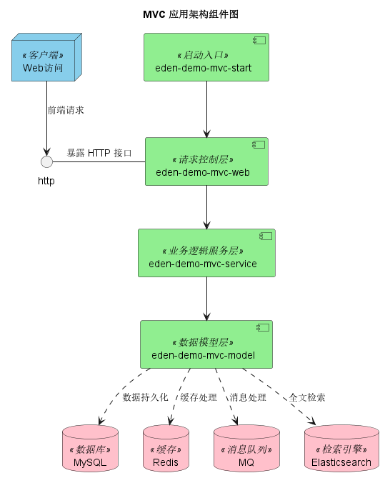

# MVC Architecture

[](https://github.com/shiyindaxiaojie/eden-demo-mvc)
[](https://github.com/shiyindaxiaojie/eden-demo-mvc/actions)
[](https://www.apache.org/licenses/LICENSE-2.0.html)
[](https://sonarcloud.io/dashboard?id=shiyindaxiaojie_eden-demo-mvc)

<p>
  <strong>A Traditional Data-Model Oriented Architecture</strong>
</p>

[简体中文](./README-zh-CN.md) | English

---

## 📖 Introduction

**MVC (Model-View-Controller) Architecture** is a traditional architectural style oriented towards data models. It separates concerns by having upper layers depend on lower layers (e.g., Use Case/Controller -> Service -> Data Model). In vertical business domains, this satisfies the single responsibility principle. Using a multi-module Maven development model helps reduce system entropy in complex scenarios and enhances development and maintenance efficiency.

## 🏗️ Architecture

<div align="center">
  
</div>

### Component Overview

| Component | Description |
|-----------|-------------|
| **eden-demo-mvc-dao** | Persistence Layer. Interacts with `MySQL`, etc. |
| **eden-demo-mvc-service** | Service Layer. Core business logic. |
| **eden-demo-mvc-web** | Controller Layer. Handles request forwarding, parameter validation, and simple view logic. |
| **eden-demo-mvc-start** | Startup Module. Manages application configuration and delivery. |

## 🚀 Getting Started

### Prerequisites

Since `Spring Boot 2.4.x` and `3.0.x` vary significantly, we maintain matching branches:

- **Branch 2.4.x**: For `Spring Boot 2.4.x` (Min JDK 1.8)
- **Branch 2.7.x**: For `Spring Boot 2.7.x` (Min JDK 11)
- **Branch 3.0.x**: For `Spring Boot 3.0.x` (Min JDK 17)

### Installation

Clone the repository and install it to your local Maven repository. This project depends on [eden-architect](https://github.com/shiyindaxiaojie/eden-architect).

```bash
git clone https://github.com/shiyindaxiaojie/eden-demo-mvc.git
cd eden-demo-mvc
mvn install -T 4C
```

### Usage

#### Quick Start

The project defaults to the `dev` environment. All external component dependencies are disabled by default for easy startup.

1.  Run `mvn install` (add `-DskipTests` to skip tests).
2.  Enter `eden-demo-mvc-start` directory and run `mvn spring-boot:run` or start the `MvcApplication` class.
3.  Test the demo API: [http://localhost:8083/api/users/1](http://localhost:8083/api/users/1).
4.  Accessing the root [http://localhost:8083](http://localhost:8083) will show a 404 page (frontend not included).


#### Configuration

-   **Database**: Default is H2. Modify `application-dev.yml` to use MySQL.
-   **Other Components**: Enable Redis, RocketMQ, etc., via `xxx.enabled` properties.

## 📦 Deployment

### FatJar
```bash
mvn -T 4C clean package
java -Dserver.port=8083 -jar target/eden-demo-mvc-start.jar
```

### Docker
```bash
docker build -f docker/Dockerfile -t eden-demo-mvc:{tag} .
```

### Helm
```bash
helm install eden-demo-mvc ./helm
```

## 📅 Versioning

We follow Semantic Versioning `x.y.z`.

## 📝 Changelog

Please see [CHANGELOG.md](https://github.com/shiyindaxiaojie/eden-demo-mvc/blob/main/CHANGELOG.md).

## 📄 License

This project is licensed under the [Apache-2.0 License](https://www.apache.org/licenses/LICENSE-2.0.html).
