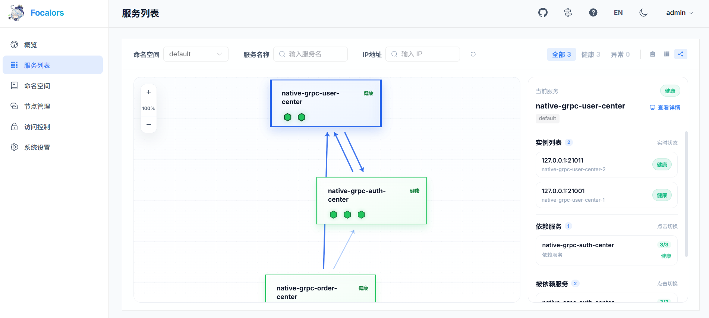
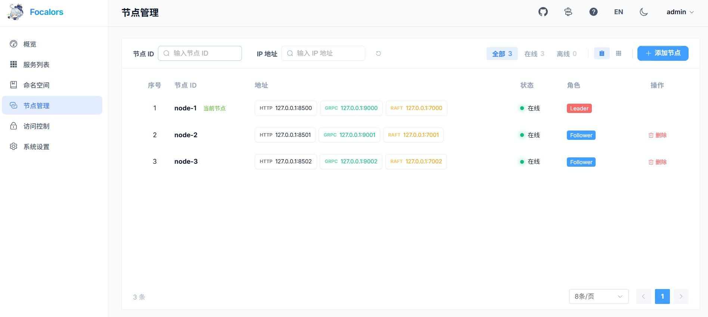
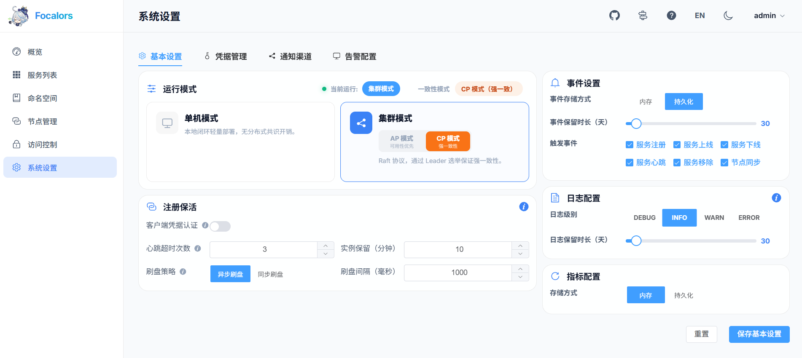
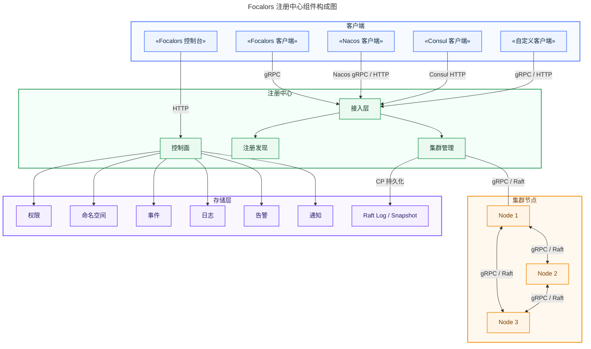
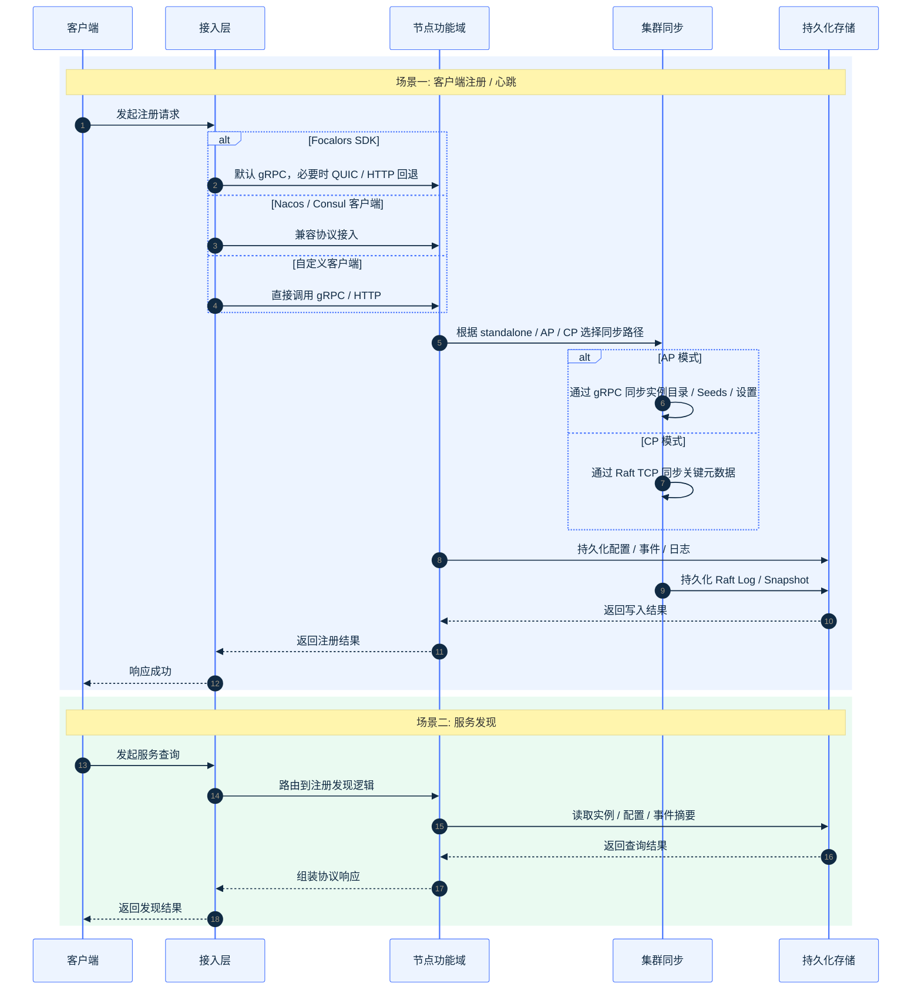

# 芙卡洛斯

[English](README.md) | 中文

Focalors（芙卡洛斯）是一个面向生产环境的轻量化服务注册中心，聚焦注册、发现、健康检查、拓扑和治理，主要面向只需要注册中心能力、不希望额外引入配置中心或 Service Mesh、或运行在内存受限环境中的系统。

## 演示样例

服务列表


服务拓扑


集群管理


系统设置


## 产品定位

Focalors 面向“只需要注册中心”的场景，覆盖注册、发现、健康控制、拓扑、治理与 AP / CP 集群协同，支持无缝接入 Nacos / Consul API。

<table>
  <tr>
    <td valign="top" width="62%">
      <strong>功能对比</strong>
      <table>
        <tr>
          <th>功能点</th>
          <th>Focalors</th>
          <th>Nacos</th>
          <th>Consul</th>
        </tr>
        <tr>
          <td>服务注册与发现</td>
          <td>✓</td>
          <td>✓</td>
          <td>✓</td>
        </tr>
        <tr>
          <td>服务健康检查</td>
          <td>✓</td>
          <td>✓</td>
          <td>✓</td>
        </tr>
        <tr>
          <td>服务上下线</td>
          <td>✓</td>
          <td>✓</td>
          <td>✓</td>
        </tr>
        <tr>
          <td>服务依赖拓扑</td>
          <td>✓</td>
          <td>✗</td>
          <td>✗</td>
        </tr>
        <tr>
          <td>AP 一致性</td>
          <td>✓</td>
          <td>✓</td>
          <td>✗</td>
        </tr>
        <tr>
          <td>CP 一致性</td>
          <td>✓</td>
          <td>✗</td>
          <td>✓</td>
        </tr>
        <tr>
          <td>AP/CP 切换</td>
          <td>✓</td>
          <td>✗</td>
          <td>✗</td>
        </tr>
        <tr>
          <td>RBAC 控制</td>
          <td>✓</td>
          <td>✓</td>
          <td>✓</td>
        </tr>
        <tr>
          <td>命名空间隔离</td>
          <td>✓</td>
          <td>✓</td>
          <td>✓（收费）</td>
        </tr>
        <tr>
          <td>弱网传输</td>
          <td>✓</td>
          <td>✗</td>
          <td>✗</td>
        </tr>
        <tr>
          <td>事件存储</td>
          <td>✓</td>
          <td>✗</td>
          <td>✗</td>
        </tr>
        <tr>
          <td>内存占用</td>
          <td>低</td>
          <td>高</td>
          <td>中</td>
        </tr>
      </table>
    </td>
    <td valign="top" width="38%">
      <strong>适用场景</strong>
      <ul>
        <li>仅需注册中心能力，不引入独立配置中心或 Service Mesh 的部署场景。</li>
        <li>同时要求 <code>AP</code> 高可用与 <code>CP</code> 一致性集群管理能力的运行环境。</li>
        <li>运行内存预算低于 <code>100MB</code> 的受限环境。</li>
      </ul>
    </td>
  </tr>
</table>

## 整体架构



- `接入层`：负责协议适配和请求路由，支持 gRPC、HTTP、QUIC，兼容 Nacos / Consul 请求。
- `注册发现`：负责实例注册、服务发现、健康状态、命名空间与拓扑能力。
- `集群管理`：负责 AP 模式下的 gRPC 复制与 CP 模式下的 Raft 共识。
- `控制面`：负责认证、权限、系统设置、告警与通知。
- `存储层`：负责事件、日志和 CP 模式下的 Raft 日志与快照。

## 运行流程



## 快速启动

启动服务端：

```bash
go run ./apps/server/cmd/server
```

默认 API 地址：

```text
http://127.0.0.1:8500
```

显式指定配置：

```bash
go run ./apps/server/cmd/server -config configs/eden-microservice.yaml.example
```

运行测试：

```bash
go work sync
go test ./packages/...
go test ./apps/auth/... ./apps/cluster/... ./apps/config/... ./apps/gateway/... ./apps/registry/... ./apps/server/...
```

## 部署模式

| 模式 | 关键配置 | 适用场景 |
| --- | --- | --- |
| 单机部署 | `mode: "standalone"` | 本地开发、测试环境、快速验证 |
| AP 可用性优先 | `mode: "cluster"` + `consistency: "ap"` | 可用性优先、允许最终一致的生产环境 |
| CP 一致性优先 | `mode: "cluster"` + `consistency: "cp"` | 一致性优先、要求 Leader 写入约束的生产环境 |

单节点示例：

```yaml
mode: "standalone"
consistency: "ap"
server:
  http: ":8500"
  grpc: "auto"
  quic: "off"
  raft: "off"
```

`grpc: "auto"` 会从 `9000-9999` 范围内选择第一个可用端口，因此本机单节点启动时默认会使用 `127.0.0.1:9000`，除非 `9000` 已被占用。

AP 集群示例：

```yaml
mode: "cluster"
consistency: "ap"
server:
  http: ":8500"
  grpc: "auto"
  quic: "off"
  raft: "off"
```

当多个 AP 节点部署在同一台机器上时，`grpc: "auto"` 会继续在 `9000-9999` 范围内顺延选择端口，通常依次为 `:9000`、`:9001`、`:9002`。

CP 集群示例：

```yaml
mode: "cluster"
consistency: "cp"
bootstrap: true
server:
  http: ":8500"
  grpc: ":9000"
  raft: "127.0.0.1:7000"
```

详细部署说明见 [部署指南](./docs/deployment_zh-CN.md)。

## 客户端集成

- Focalors SDK：面向 Go 服务，作为主要接入路径。
  对应示例：[Focalors 集成示例](./apps/registry/examples/service-discovery/native/README.md)
- Nacos 兼容：面向 Nacos Naming 存量系统，尽量少改业务代码。
  对应示例：[Nacos 迁移示例](./apps/registry/examples/service-discovery/nacos/README.md)
- Consul 兼容：面向 Consul HTTP / SDK 存量系统，保留原有调用模型。
  对应示例：[Consul 迁移示例](./apps/registry/examples/service-discovery/consul/README.md)
- 自定义 gRPC / HTTP：面向外部项目，直接对接公开协议。
  对应示例：[自定义协议示例](./apps/registry/examples/service-discovery/custom/README.md)

## 开发说明

开发时先判断变更落在哪一层，再进入对应目录。

| 开发任务 | 入口目录 |
| --- | --- |
| 聚合服务启动与运行时装配 | `apps/server` |
| 注册、发现、兼容适配与 Go SDK | `apps/registry` |
| 配置中心 | `apps/config` |
| 网关控制面与数据面 | `apps/gateway` |
| 登录、权限与 API Key | `apps/auth` |
| AP / CP、成员管理与运行设置 | `apps/cluster` |
| 共享进程与传输基础包 | `packages` |
| 控制台 | `apps/ui` |

目录结构图：

```text
eden-microservice
├─ go.work                   # Go workspace
├─ apps
│  ├─ registry              # 注册中心、兼容适配、SDK
│  ├─ config                # 配置中心
│  ├─ gateway               # 网关路由与代理
│  ├─ auth                  # 权限控制
│  ├─ cluster               # 集群管理
│  ├─ server                # 默认聚合进程
│  └─ ui                    # Vue 控制台
├─ packages                 # 本地共享包
├─ configs                  # 运行配置示例
└─ docs                     # 架构、部署、集成文档
```

常用开发命令：

```bash
go work sync
go run ./apps/server/cmd/server
go run ./apps/server/cmd/server -config configs/eden-microservice.yaml.example
go test ./apps/registry/... ./apps/config/... ./apps/gateway/... ./apps/auth/... ./apps/cluster/... ./apps/server/... ./packages/...
```

开发建议：

- 改注册发现行为，优先看 `apps/registry/internal/catalog`，不要先从兼容层改起。
- 改 AP / CP 一致性或节点协同，优先看 `apps/cluster/internal/cluster`。
- 改统一传输装配看 `apps/server/internal/transport`；兼容接口归所属领域模块。
- 改 SDK 或接入体验时，同时检查 `apps/registry/pkg/sdk` 和模块内示例。

## 文档索引

- [系统架构](./docs/architecture_zh-CN.md)
- [部署指南](./docs/deployment_zh-CN.md)
- [集成指南](./docs/integration_zh-CN.md)

## 📄 许可证

本项目采用 Apache License 2.0 许可证。详情请参阅 [LICENSE](LICENSE) 文件。
