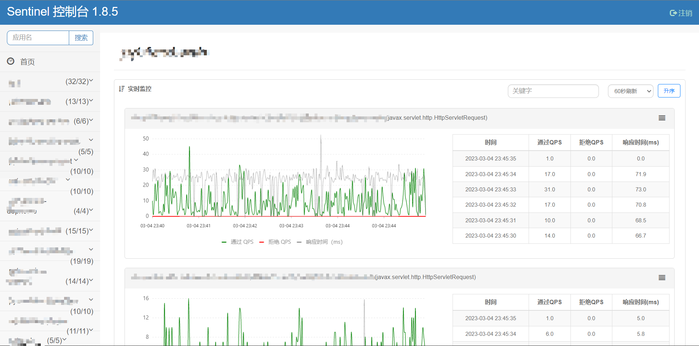
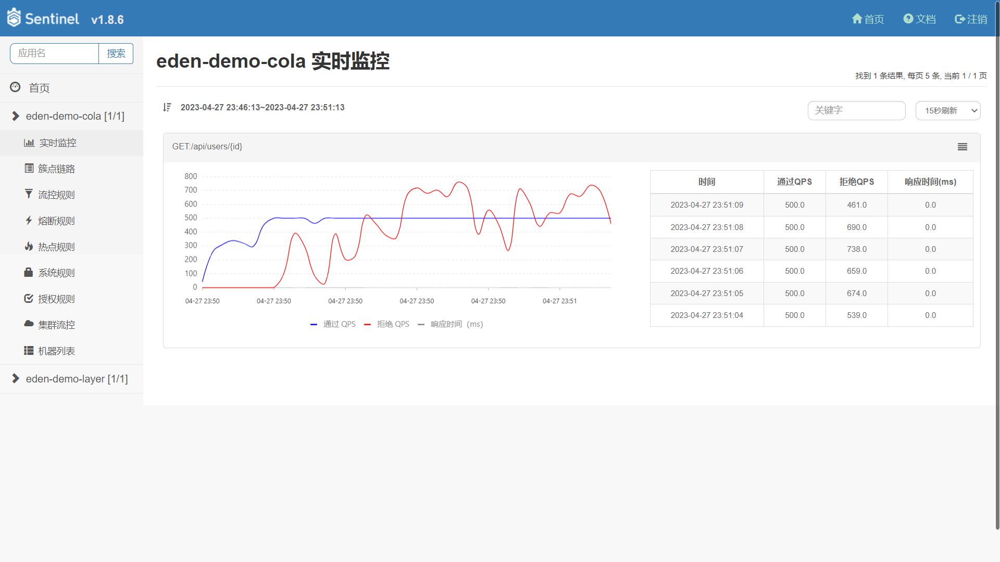
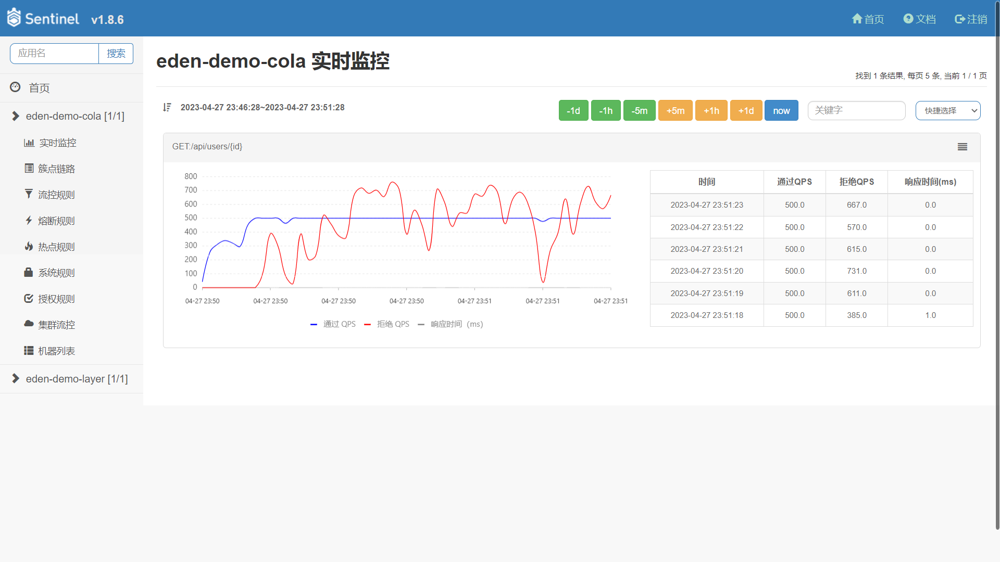

[license-apache2.0]:https://www.apache.org/licenses/LICENSE-2.0.html

[github-action]:https://github.com/shiyindaxiaojie/Sentinel/actions

[sonarcloud-dashboard]:https://sonarcloud.io/dashboard?id=shiyindaxiaojie_Sentinel

# Sentinel 流量治理平台

 [][license-apache2.0] [][github-action] [][sonarcloud-dashboard] [](https://api.gitsponsors.com/api/badge/link?p=f4MOfJnZFZJctyNku60flTab9z/6DYv9K8fN66Mb3eSUwrrWeWbxEdkBFqA/7+RUENNaV/TR2A473Ahs6cBrB8g7zFFDar66aKLVq0Thcwi1OqQkNen30+Aax+4cxcOPWzumhkOlM4LCa0Q/kn6JNQ==)

Sentinel 是阿里巴巴开源的流量治理平台，提供了 `流量控制`、`熔断降级`、`系统负载保护`、`黑白名单访问控制` 等功能。在实际的生产需求中，笔者进行了部分扩展：
1. 流控规则持久化：适配 `Apollo`、`Nacos`、`Zookeeper`
2. 监控数据持久化：适配 `InfluxDB`、`Kafka`、`Elasticsearch`
3. 监控面板优化：新增时间控件，允许在任意时刻内查询监控数据。

## 演示图例

### 改造前



### 改造后



快捷时间选择



自定义时间选择


## 如何构建

本项目默认使用 Maven 来构建，最快的使用方式是 `git clone` 到本地。在项目的根目录执行 `mvn install -T 4C` 完成本项目的构建。

## 如何启动

### IDEA 启动

本项目默认不依赖外部组件，可以直接启动运行。

1. 在项目目录下运行 `mvn install`（如果不想运行测试，可以加上 `-DskipTests` 参数）。
2. 进入 `sentinel-dashboard` 目录，执行 `mvn spring-boot:run` 或者启动 `SentinelApplication` 类。运行成功的话，可以看到 `Spring Boot` 启动成功的界面。

在实际的生产需求，Sentinel 保存的规则和监控是需要持久化落盘的，因此，您可以在 `sentinel-dashboard/src/main/resources/application.properties` 接入外部组件。

* 规则存储类型：memory（默认）、nacos（推荐）、apollo、zookeeper
```properties
# 规则存储类型，可选项：memory（默认）、nacos（推荐）、apollo、zookeeper
sentinel.rule.type=nacos
# Nacos 存储规则，如果您设置了 sentinel.metrics.type=nacos，需要调整相关配置
sentinel.rule.nacos.server-addr=localhost:8848
sentinel.rule.nacos.namespace=demo
sentinel.rule.nacos.group-id=sentinel
sentinel.rule.nacos.username=nacos
sentinel.rule.nacos.password=nacos
# Apollo 存储规则，如果您设置了 sentinel.metrics.type=apollo，需要调整相关配置
sentinel.rule.apollo.portal-url=http://localhost:10034
sentinel.rule.apollo.token=
sentinel.rule.apollo.env=
# Zookeeper 存储规则，如果您设置了 sentinel.metrics.type=zookeeper，需要调整相关配置
sentinel.rule.zookeeper.connect-string=localhost:2181
sentinel.rule.zookeeper.root-path=/sentinel_rule
```

* 监控存储类型：memory（默认）、influxdb（推荐）、elasticsearch
```properties
# 监控存储类型，可选项：memory（默认）、influxdb（推荐）、elasticsearch
sentinel.metrics.type=memory
# InfluxDB 存储监控数据，如果您设置了 sentinel.metrics.type=influxdb，需要调整相关配置
influx.url=http://localhost:8086/
influx.token=UfgaW37A93PkncmJum25G7M2QkBg6xqqjGthh-o-UIVIynC_-Q7RFWlTtEpMqhGLCuAsX64k3Isc2uN33YgElw==
influx.org=sentinel
influx.bucket=sentinel
influx.log-level=NONE
influx.read-timeout=10s
influx.write-timeout=10s
influx.connect-timeout=10s
# Elasticsearch 存储监控数据，如果您设置了 sentinel.metrics.type=elasticsearch，需要调整相关配置
sentinel.metrics.elasticsearch.index-name=sentinel_metric
spring.elasticsearch.rest.uris=http://localhost:9200
spring.elasticsearch.rest.connection-timeout=3000
spring.elasticsearch.rest.read-timeout=5000
spring.elasticsearch.rest.username=
spring.elasticsearch.rest.password=
# 监控数据存储缓冲设置，降低底层存储组件写入压力。可选项：none（默认不启用）、kafka（推荐）
sentinel.metrics.sender.type=none
# Kafka 存储监控数据，如果您设置了 sentinel.metrics.sender.type=kafka，需要调整相关配置
sentinel.metrics.sender.kafka.topic=sentinel_metric
spring.kafka.producer.bootstrap-servers=localhost:9092
spring.kafka.producer.batch-size=4096
spring.kafka.producer.buffer-memory=40960
spring.kafka.producer.key-serializer=org.apache.kafka.common.serialization.StringSerializer
spring.kafka.producer.value-serializer=org.apache.kafka.common.serialization.StringSerializer
```

### 镜像启动

本项目已发布到 [Docker Hub](https://hub.docker.com/repository/docker/shiyindaxiaojie/sentinel-dashboard)，请执行参考命令运行。

```bash
docker run -p 8090:8090 --name=sentinel-dashboard -d shiyindaxiaojie/sentinel-dashboard
```

## 如何部署

### FatJar 部署

执行 `mvn clean package` 打包成一个 fat jar，参考如下命令启动编译后的控制台。

```bash
java -Dserver.port=8080 \
-Dsentinel.rule.nacos.server-addr=localhost:8848 \
-Dsentinel.rule.nacos.namespace=demo \
-Dsentinel.rule.nacos.group-id=sentinel \
-Dsentinel.metrics.type=influxdb \
-Dinflux.url=http://localhost:8086 \
-Dinflux.token=XXXXXX \
-Dinflux.org=sentinel \
-Dinflux.bucket=sentinel \
-jar target/sentinel-dashboard.jar
```

### Docker 部署

本项目使用了 Spring Boot 的镜像分层特性优化了镜像的构建效率，请确保正确安装了 Docker 工具，然后执行以下命令。

```bash
docker build -f docker/Dockerfile -t sentinel-dashboard:{tag} .
```

### Helm 部署

以应用为中心，建议使用 Helm 统一管理所需部署的 K8s 资源描述文件，请参考以下命令完成应用的安装和卸载。

```bash
helm install sentinel-dashboard ./helm # 部署资源
helm uninstall sentinel-dashboard # 卸载资源
```

## 如何接入

为了减少客户端集成的工作，您可以使用 [eden-architect](https://github.com/shiyindaxiaojie/eden-architect) 框架，只需要两步就可以完成 Sentinel 的集成。

1. 引入 Sentinel 依赖
````xml
<dependency>
    <groupId>io.github.shiyindaxiaojie</groupId>
    <artifactId>eden-sentinel-spring-cloud-starter</artifactId>
</dependency>
````
2. 开启 Sentinel 配置
````yaml
spring:
  cloud:
    sentinel: # 流量治理组件
      enabled: false # 默认关闭，请按需开启
      http-method-specify: true # 兼容 RESTful
      eager: true # 立刻刷新到 Dashboard
      transport:
        dashboard: localhost:8080
      datasource:
        flow:
          nacos:
            server-addr: ${spring.cloud.nacos.config.server-addr}
            namespace: ${spring.cloud.nacos.config.namespace}
            groupId: sentinel
            dataId: ${spring.application.name}-flow-rule
            rule-type: flow
            data-type: json
````

笔者提供了两种不同应用架构的示例，里面有集成 Sentinel 的示例。
* 面向领域模型的 **COLA 架构**，代码实例可以查看 [eden-demo-cola](https://github.com/shiyindaxiaojie/eden-demo-cola)
* 面向数据模型的 **分层架构**，代码实例请查看 [eden-demo-layer](https://github.com/shiyindaxiaojie/eden-demo-layer)

## 变更日志

请查阅 [CHANGELOG.md](https://github.com/shiyindaxiaojie/Sentinel/blob/1.8.x/CHANGELOG.md)
